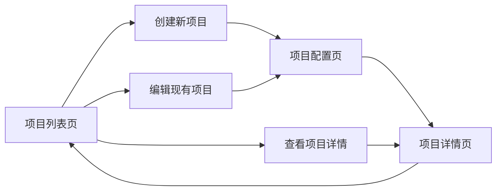

# 📚 小说朗读页面重构报告

## 🎯 重构目标

**老爹提出的用户体验优化需求：**
- 重构现有novel-reader页面的混乱布局
- 支持自定义项目名称和默认配置
- 提供项目列表管理界面
- 优化用户操作流程：项目列表 → 项目配置 → 详情页面

## ✅ 重构成果

### 🗂️ **新的页面架构**

```
原来：单页面混合所有功能
现在：三页面分层架构

📋 NovelProjects.vue        - 项目列表页
⚙️ NovelProjectCreate.vue   - 项目创建/配置页  
🎙️ NovelReader.vue         - 项目详情/生成页
```

### 🔄 **优化后的用户流程**



## 📄 **页面功能详解**

### 1. **NovelProjects.vue - 项目列表页** 📋

**功能特点：**
- ✅ 项目卡片式展示，包含完成度、角色数量、段落数量
- ✅ 搜索和状态筛选功能
- ✅ 项目统计数据展示
- ✅ 支持复制、导出、删除项目
- ✅ 响应式设计，移动端友好

**核心代码结构：**
```vue
// 项目统计
const projectStats = computed(() => {
  const stats = { total: 0, completed: 0, processing: 0, pending: 0 }
  projects.value.forEach(project => {
    stats.total++
    if (project.status === 'completed') stats.completed++
    // ... 其他统计
  })
  return stats
})

// 项目操作
const onProjectAction = async ({ key }, project) => {
  switch (key) {
    case 'edit': configureProject(project); break
    case 'duplicate': await duplicateProject(project); break
    case 'export': exportProject(project); break
    case 'delete': confirmDeleteProject(project); break
  }
}
```

### 2. **NovelProjectCreate.vue - 项目创建/配置页** ⚙️

**功能特点：**
- ✅ 三步骤创建流程：基本信息 → 文本上传 → 确认创建
- ✅ 自定义项目名称、类型、描述、标签
- ✅ 预配置朗读设置（分段方式、速度、音质等）
- ✅ 支持文件上传和直接文本输入
- ✅ 实时文本预览和统计信息
- ✅ 编辑模式复用

**核心代码结构：**
```vue
// 步骤控制
const canProceed = computed(() => {
  if (currentStep.value === 0) {
    return projectForm.name.trim().length >= 2
  }
  if (currentStep.value === 1) {
    return textPreview.value && textPreview.value.length > 10
  }
  return true
})

// 文本统计
const textStats = computed(() => {
  const text = textPreview.value || ''
  const totalChars = text.length
  const estimatedSegments = Math.ceil(totalChars / 200)
  const estimatedMinutes = Math.ceil(totalChars / 300)
  
  return {
    totalChars,
    estimatedSegments,
    estimatedDuration: `约 ${estimatedMinutes} 分钟`
  }
})
```

### 3. **NovelReader.vue - 项目详情/生成页** 🎙️

**功能特点：**
- ✅ 专注于语音生成和角色配置
- ✅ 显示当前项目信息和统计
- ✅ 简化的导航操作
- ✅ 优化的界面布局

**核心代码结构：**
```vue
// 路由参数加载项目
onMounted(async () => {
  await loadVoiceProfiles()
  
  const projectIdFromRoute = route.params.id
  if (projectIdFromRoute) {
    await loadProjectById(projectIdFromRoute)
  } else {
    router.push('/novel-reader')
  }
})

// 导航操作
const goBackToList = () => {
  router.push('/novel-reader')
}

const editProject = () => {
  if (currentProject.value?.id) {
    router.push(`/novel-reader/edit/${currentProject.value.id}`)
  }
}
```

## 🛠️ **路由配置更新**

```javascript
// 新的路由结构
const routes = [
  {
    path: '/novel-reader',
    name: 'NovelProjects',
    component: NovelProjects        // 项目列表页
  },
  {
    path: '/novel-reader/create',
    name: 'NovelProjectCreate', 
    component: NovelProjectCreate   // 创建新项目
  },
  {
    path: '/novel-reader/edit/:id',
    name: 'NovelProjectEdit',
    component: NovelProjectCreate   // 编辑项目
  },
  {
    path: '/novel-reader/detail/:id',
    name: 'NovelReaderDetail',
    component: NovelReader          // 项目详情
  }
]
```

## 🎨 **用户体验优化**

### **1. 信息架构优化**
- **分离关注点**: 项目管理 vs 语音生成分开
- **减少认知负荷**: 每个页面专注单一功能
- **清晰的信息层级**: 统计 → 列表 → 详情

### **2. 交互流程优化**
- **渐进式创建**: 分步骤完成项目创建
- **即时反馈**: 实时预览和验证
- **一致性操作**: 统一的按钮和交互模式

### **3. 视觉设计优化**
- **卡片式布局**: 提升项目信息可读性
- **渐变背景**: 提升页面视觉层次
- **状态标识**: 清晰的项目状态显示

## 📊 **技术实现亮点**

### **1. 组件复用**
```vue
// NovelProjectCreate.vue 同时支持创建和编辑
const isEditing = computed(() => !!route.params.id)

// 根据模式加载不同数据
const loadEditData = async () => {
  if (isEditing.value) {
    const response = await readerAPI.getProjectDetail(route.params.id)
    // 填充表单数据
  }
}
```

### **2. 状态管理**
```vue
// 项目统计的计算属性
const projectStats = computed(() => {
  const stats = { total: 0, completed: 0, processing: 0, pending: 0 }
  projects.value.forEach(project => {
    stats.total++
    if (project.status === 'completed') stats.completed++
    else if (project.status === 'processing') stats.processing++
    else if (project.status === 'pending') stats.pending++
  })
  return stats
})
```

### **3. 响应式设计**
```css
@media (max-width: 768px) {
  .projects-grid {
    grid-template-columns: 1fr;
  }
  
  .page-header {
    flex-direction: column;
    gap: 16px;
  }
}
```

## 🚀 **重构效果**

### **用户体验提升**
- ✅ **操作流程清晰**: 从混乱的单页面变为清晰的三步流程
- ✅ **信息查找效率**: 项目列表一目了然，支持搜索筛选
- ✅ **自定义能力**: 完全自定义项目配置，不再依赖自动生成名称
- ✅ **视觉体验**: 现代化卡片设计，信息层次分明

### **开发维护性**
- ✅ **代码分离**: 每个页面职责单一，便于维护
- ✅ **组件复用**: 创建和编辑页面复用同一组件
- ✅ **路由清晰**: RESTful风格的路由设计

### **功能完整性**
- ✅ **项目管理**: 增删改查、复制导出功能完整
- ✅ **配置灵活**: 支持多种朗读参数预设
- ✅ **文件支持**: 支持多格式文件上传和直接输入

## 🎯 **后续优化方向**

1. **批量操作**: 支持批量删除、导出项目
2. **模板系统**: 预设项目模板，快速创建
3. **协作功能**: 项目分享和团队协作
4. **高级筛选**: 按标签、日期范围等筛选
5. **性能优化**: 虚拟滚动、懒加载等

---

**重构总结**: 成功将混乱的单页面重构为清晰的三页面架构，显著提升了用户体验和开发维护性。新的流程更符合用户的心理模型：管理项目 → 配置项目 → 生成语音。 