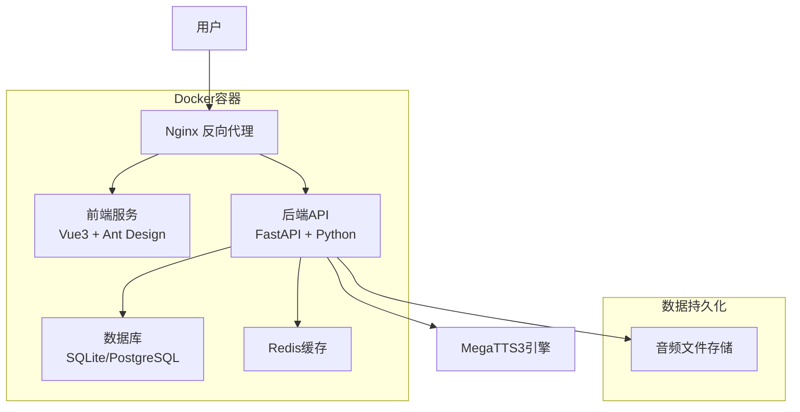

# 🎵 AI-Sound

AI-Sound 是一个统一管理多种 TTS（文本转语音）引擎的综合平台，提供无缝整合的语音合成服务。

## ✨ 项目特点

- **🚀 多引擎支持**：整合 MegaTTS3、ESPnet 和 Bert-VITS2（计划中）
- **🔗 统一 API**：提供标准化接口，简化集成过程
- **🧠 智能引擎选择**：根据文本特征自动选择最合适的引擎
- **🎭 智能角色分配**：基于角色名称自动分配合适的声音类型
- **📖 多角色朗读**：支持小说文本的智能分段和多角色语音合成
- **📊 服务监控**：实时监控各引擎的健康状态
- **🐳 Docker 化部署**：简化安装和扩展过程

## 🎯 核心功能

### 🎭 智能角色声音分配

AI-Sound 提供智能角色声音分配功能，能够根据角色名称自动推断性别并分配合适的声音。

#### 🧠 智能识别规则

**性别识别算法 (`inferGender`)**：
```javascript
// 女性角色关键词
const femaleIndicators = ['雅', '柔', '婷', '娜', '丽', '美', '小姐', '女士']

// 男性角色关键词  
const maleIndicators = ['浩', '强', '明', '军', '刚', '先生', '男士', '少爷']

// 智能判断逻辑
if (name.includes(femaleIndicator)) return 'female'  // 女性
if (name.includes(maleIndicator)) return 'male'      // 男性
return 'neutral'  // 中性/未知
```

#### 🎵 分配策略

1. **性别匹配优先**：女性角色 → 女声库，男性角色 → 男声库
2. **循环均匀分配**：避免所有角色使用同一个声音
3. **类型降级策略**：无匹配性别声音时使用中性声音
4. **兜底保护机制**：确保每个角色都能分配到声音

#### 📊 分配示例

假设角色：`林清雅`、`张浩然`、`小美`、`李强`、`旁白`

**智能识别结果**：
- `林清雅` → female（包含"雅"）
- `张浩然` → male（包含"浩"）  
- `小美` → female（包含"美"）
- `李强` → male（包含"强"）
- `旁白` → neutral

**智能分配结果**：
- `林清雅` → 女声1（温柔女声）
- `小美` → 女声2（专业主播）
- `张浩然` → 男声1（磁性男声）
- `李强` → 男声2（老者声音）
- `旁白` → 中性声（童声）

#### 🔄 分配算法

```javascript
// 1. 声音库分类
const femaleVoices = voices.filter(v => v.type === 'female')
const maleVoices = voices.filter(v => v.type === 'male')
const neutralVoices = voices.filter(v => v.type === 'neutral' || v.type === 'child')

// 2. 循环分配索引
let femaleIndex = 0, maleIndex = 0, neutralIndex = 0

// 3. 智能分配
characters.forEach(character => {
  if (character.gender === 'female' && femaleVoices.length > 0) {
    character.voiceId = femaleVoices[femaleIndex % femaleVoices.length].id
    femaleIndex++
  } else if (character.gender === 'male' && maleVoices.length > 0) {
    character.voiceId = maleVoices[maleIndex % maleVoices.length].id
    maleIndex++
  } else if (neutralVoices.length > 0) {
    character.voiceId = neutralVoices[neutralIndex % neutralVoices.length].id
    neutralIndex++
  } else {
    character.voiceId = availableVoices[0]?.id  // 兜底策略
  }
})
```

#### ⚡ 使用方式

1. **自动识别**：上传小说文件后，系统自动识别角色和性别
2. **智能分配**：点击"智能分配"按钮，系统自动为所有角色分配合适声音
3. **手动调整**：可以手动修改任意角色的声音分配
4. **声音试听**：支持为每个角色生成测试音频进行试听

## 🔥 当前状态

### ✅ 已运行服务
- **MegaTTS3 API 服务**：`http://localhost:7929` - GPU加速，WaveVAE decoder-only模式
- **AI-Sound Platform API**：`http://localhost:8000` - 统一后端API服务
- **Web 管理界面**：`http://localhost:3000` - Vue3前端界面
- **API 文档服务**：`http://localhost:8888` - 交互式文档和演示

### 🎯 MegaTTS3 重要说明
**MegaTTS3 采用 WaveVAE decoder-only 架构设计**：
- ⚠️ **必需文件**：语音合成需要同时提供 `.wav` 音频文件和对应的 `.npy` latent文件
- 🔒 **安全设计**：官方出于安全考虑，未发布 WaveVAE encoder 参数
- 📁 **文件要求**：对于说话人A，需要在同一目录下有 `A.wav` 和 `A.npy` 文件
- 🌐 **获取latent**：可通过官方提供的链接上传音频文件获取对应的 `.npy` 文件

### 📂 项目结构（已优化）
```
AI-Sound/
├── 📘 README.md                    # 项目主文档
├── 📋 CHANGELOG.md                 # 更新日志
├── 🎯 MegaTTS/                     # 🔥 MegaTTS3核心引擎
│   └── MegaTTS3/                   # TTS引擎目录
│       ├── api_server.py           # API服务器
│       ├── Dockerfile              # 引擎容器镜像
│       ├── requirements.txt        # Python依赖
│       ├── configs/                # 引擎配置
│       │   ├── model_config.yaml   # 模型配置
│       │   └── api_config.yaml     # API配置
│       ├── checkpoints/            # 🧠 模型权重文件
│       │   ├── dit_base/           # 基础模型
│       │   ├── dit_large/          # 大型模型
│       │   └── wavevae/            # 声码器模型
│       ├── storage/                # 🎵 声音数据存储
│       │   ├── voices/             # 声音样本库
│       │   ├── cache/              # 推理缓存
│       │   └── temp/               # 临时文件
│       └── logs/                   # 📊 引擎日志
├── 🌐 platform/                   # 统一平台架构
│   ├── 🚀 backend/                # FastAPI后端服务
│   │   ├── app/
│   │   │   ├── main.py            # 主应用入口
│   │   │   ├── megatts3_client.py # 🔥 MegaTTS3客户端
│   │   │   ├── novel_reader.py    # 小说朗读模块
│   │   │   ├── characters.py      # 角色声音管理
│   │   │   └── voice_clone.py     # 语音克隆模块
│   │   ├── Dockerfile             # 后端镜像
│   │   └── requirements.txt       # Python依赖
│   └── 🎨 frontend/               # Vue3前端界面
│       ├── src/
│       │   ├── views/
│       │   │   ├── NovelReader.vue    # 智能朗读页面
│       │   │   ├── VoiceClone.vue     # 语音克隆页面
│       │   │   └── AudioLibrary.vue   # 音频库管理
│       │   └── api/
│       │       ├── index.js           # 平台API客户端
│       │       └── megatts3.js        # 🔥 MegaTTS3 API封装
│       └── Dockerfile             # 前端镜像
├── 🐳 docker/                     # Docker配置目录
│   ├── nginx/
│   │   ├── nginx.conf             # Nginx主配置
│   │   └── ssl/                   # SSL证书
│   ├── database/
│   │   └── init.sql               # 数据库初始化
│   └── megatts3/                  # 🔥 MegaTTS3容器配置
│       ├── Dockerfile             # 引擎专用镜像
│       ├── docker-compose.yml     # 独立编排文件
│       └── configs/               # 容器配置
├── 📚 docs/                       # 项目文档
│   ├── deployment.md              # 📋 部署指南
│   ├── megatts3-integration.md    # 🔥 MegaTTS3集成文档
│   ├── api.md                     # 📡 API接口文档
│   └── troubleshooting.md         # 🔧 故障排查
├── 🛠️ scripts/                    # 自动化脚本
│   ├── start.sh                   # 一键启动脚本
│   ├── start_with_megatts3.sh     # 🔥 含MegaTTS3启动
│   ├── megatts3_health.sh         # 🔥 MegaTTS3健康检查
│   ├── backup.sh                  # 数据备份脚本
│   └── backup_megatts3.sh         # 🔥 MegaTTS3专用备份
├── 🔧 services/                   # 微服务架构
├── 🛠️ tools/                      # 工具目录
├── 💾 data/                       # 数据持久化目录
│   ├── audio/                     # 🎵 生成的音频文件
│   ├── database/                  # 🗄️ 数据库文件
│   ├── logs/                      # 📋 服务日志
│   │   ├── nginx/                 # Nginx日志
│   │   ├── backend/               # 后端日志
│   │   ├── frontend/              # 前端日志
│   │   └── megatts3/              # 🔥 MegaTTS3日志
│   ├── uploads/                   # 📤 用户上传文件
│   ├── voice_profiles/            # 🎤 声音配置文件
│   ├── cache/                     # ⚡ 缓存数据
│   └── config/                    # ⚙️ 运行时配置
├── 🗃️ archive/                    # 历史文件归档
├── 🐳 docker-compose.yml          # 主服务编排
├── 🐳 docker-compose.megatts3.yml # 🔥 MegaTTS3服务编排
└── ⚙️ .env.example                # 环境变量模板
```

## 🚀 快速开始

### 📋 安装要求

- Docker 20.10+
- NVIDIA Container Toolkit (用于 GPU 支持)
- Python 3.8+ (用于本地文档服务)

### ⚡ 启动 MegaTTS3 服务

#### 方法一：Docker 服务（推荐）
```bash
# 启动GPU加速的API服务
docker run -d --name megatts3-api --gpus all -p 7929:7929 \
  -v "D:\AI-Sound\MegaTTS\MegaTTS3:/app" \
  -e CUDA_VISIBLE_DEVICES=0 megatts3:latest tail -f /dev/null

# 安装依赖并启动API
docker exec megatts3-api pip install flask flask-cors
docker exec -d megatts3-api bash -c "cd /app; python api_server.py"
```

#### 方法二：本地文档服务
```bash
cd MegaTTS\MegaTTS3
python start_api_demo.py
```

### 🌐 访问服务

- **🎵 TTS API 服务**：http://localhost:7929
  - 健康检查：`GET /health`
  - 语音合成：`POST /synthesize`
  
- **📖 API 文档**：http://localhost:8888
  - 完整文档：`/api_docs.html`
  - 交互演示：`/api_demo_page.html`

## 💻 API 使用示例

### ⚠️ 重要提醒
**MegaTTS3 语音合成必须同时提供音频文件和latent文件**

### Python 调用示例
```python
import requests
import json

# 健康检查
health = requests.get("http://localhost:7929/health")
print("服务状态:", health.json())

# 语音合成 - 注意：需要同时上传 .wav 和 .npy 文件
files = {
    'audio_file': open('reference_speaker.wav', 'rb'),
    'latent_file': open('reference_speaker.npy', 'rb')  # 必需！
}
data = {
    'text': '欢迎使用AI-Sound MegaTTS3服务！',
    'p_w': 1.4,
    't_w': 3.0,
    'time_step': 32
}

response = requests.post("http://localhost:7929/synthesize", 
    files=files, data=data
)

# 保存音频文件
if response.status_code == 200:
    with open("output.wav", "wb") as f:
        f.write(response.content)
    print("✅ 音频生成成功！")
else:
    print("❌ 生成失败:", response.json())
```

### cURL 调用示例
```bash
# 健康检查
curl http://localhost:7929/health

# 语音合成 - 必须同时上传两个文件
curl -X POST http://localhost:7929/synthesize \
  -F "audio_file=@reference_speaker.wav" \
  -F "latent_file=@reference_speaker.npy" \
  -F "text=你好，世界！" \
  -F "p_w=1.4" \
  -F "t_w=3.0" \
  -F "time_step=32" \
  --output output.wav
```

## 🔧 项目管理

### 🧹 最近更新
- ✅ 项目清理完成：归档28个历史文件
- ✅ 目录结构优化：精简到19个核心文件
- ✅ MegaTTS3服务稳定运行：GPU加速支持
- ✅ 完整API文档：交互式演示页面
- ✅ 前后端真实对接：Novel Reader页面与后端API完全集成
- ✅ 智能角色分配：基于角色名称的自动声音分配算法实现
- ✅ 统一平台架构：FastAPI后端 + Vue3前端 + MegaTTS3引擎

### 📊 服务状态检查
```bash
# 检查Docker容器
docker ps -a

# 检查端口占用
netstat -ano | findstr :7929   # MegaTTS3 API
netstat -ano | findstr :8000   # Platform Backend
netstat -ano | findstr :3000   # Frontend UI
netstat -ano | findstr :8888   # API Documentation

# 快速健康检查
curl http://localhost:7929/health
curl http://localhost:8000/health
```

## 🎯 未来规划

### 短期目标
- [ ] 集成更多语音模型
- [ ] 完善错误处理机制
- [ ] 性能监控面板
- [ ] 批量处理接口

### 长期目标
- [ ] Bert-VITS2 引擎整合
- [ ] 多语言支持增强
- [ ] 实时语音流处理
- [ ] 云端部署方案

## 🗂️ 项目文档

- [📋 更新日志](CHANGELOG.md)
- [📁 启动指南](MegaTTS/MegaTTS3/启动指南.md)
- [🗃️ 项目清理计划](项目清理计划.md)
- [📋 部署文档](docs/deployment.md) - 完整的容器化部署指南
- [🎤 MegaTTS3集成文档](docs/megatts3-integration.md) - MegaTTS3引擎详细集成方案
- [📡 API接口文档](docs/api.md) - 详细的API使用说明
- [🔧 故障排查文档](docs/troubleshooting.md) - 常见问题解决方案

## 🤝 贡献指南

欢迎贡献代码！请确保：
1. 遵循现有代码风格
2. 测试新功能
3. 更新相关文档
4. 不影响MegaTTS3核心服务

## 📄 许可证

本项目采用 MIT 许可证 - 详见 [LICENSE](LICENSE) 文件

---

**🎉 AI-Sound - 让语音合成更简单！**

# AI-Sound Platform

[](LICENSE)
[](https://python.org)
[](https://vuejs.org)
[](https://docker.com)

基于 MegaTTS3 的智能语音克隆和多角色朗读平台，提供企业级的语音合成解决方案。

## ✨ 特性概览

- 🎙️ **高质量语音克隆** - 基于MegaTTS3引擎，支持零样本语音克隆
- 👥 **多角色朗读** - 智能角色识别与多声线小说朗读
- 🎵 **音频资源库** - 统一管理所有生成的音频文件
- 🔧 **声音库管理** - 完整的声音配置文件管理系统
- 📊 **实时监控** - 完善的系统监控和日志记录
- 🐳 **容器化部署** - 支持Docker一键部署，生产就绪
- 🌐 **现代化界面** - Vue3 + Ant Design Vue响应式设计

## 🏗️ 系统架构



## 🚀 快速开始

### 方式一：Docker 部署（推荐）

#### 前置要求
- Docker 20.0+
- Docker Compose 2.0+
- 系统内存 ≥ 4GB
- 磁盘空间 ≥ 10GB

#### 一键部署

```bash
# 1. 克隆项目
git clone https://github.com/your-org/AI-Sound.git
cd AI-Sound

# 2. 创建数据目录
mkdir -p data/{audio,database,logs,uploads,voice_profiles,cache,config}

# 3. 配置环境变量
cp .env.example .env
# 编辑 .env 文件，设置必要的配置

# 4. 启动服务
docker-compose up -d

# 5. 查看服务状态
docker-compose ps

# 6. 查看日志
docker-compose logs -f
```

#### 访问地址
- **前端界面**: http://localhost
- **API文档**: http://localhost/docs
- **健康检查**: http://localhost/health

### 方式二：开发环境部署

#### 前置要求
- Python 3.11+
- Node.js 18+
- MegaTTS3引擎运行在端口9000

#### 后端服务

```bash
cd platform/backend

# 安装依赖
pip install -r requirements.txt

# 初始化数据库
python create_audio_table.py

# 启动服务
python -m uvicorn app.main:app --host 0.0.0.0 --port 8000 --reload
```

#### 前端服务

```bash
cd platform/frontend

# 安装依赖
npm install

# 启动开发服务器
npm run dev
```

## 📁 项目结构

```
AI-Sound/
├── 📄 docker-compose.yml          # Docker编排配置
├── 📄 .env.example               # 环境变量模板
├── 📂 docs/                      # 📚 文档目录
│   ├── deployment.md             # 🚀 部署文档
│   ├── api.md                    # 📡 API文档
│   └── troubleshooting.md        # 🔧 故障排查
├── 📂 docker/                    # 🐳 Docker配置
│   ├── nginx/                    # Nginx配置
│   └── database/                 # 数据库配置
├── 📂 platform/                  # 💻 应用代码
│   ├── frontend/                 # 🎨 Vue3前端
│   │   ├── src/
│   │   │   ├── views/            # 页面组件
│   │   │   ├── api/              # API接口
│   │   │   └── router/           # 路由配置
│   │   └── Dockerfile            # 前端镜像
│   └── backend/                  # ⚙️ FastAPI后端
│       ├── app/
│       │   ├── models.py         # 数据模型
│       │   ├── audio_library.py  # 音频库API
│       │   ├── novel_reader.py   # 多角色朗读API
│       │   └── main.py           # 主应用
│       ├── requirements.txt      # Python依赖
│       └── Dockerfile            # 后端镜像
└── 📂 data/                      # 💾 数据持久化
    ├── audio/                    # 🎵 音频文件
    ├── database/                 # 🗄️ 数据库文件
    ├── logs/                     # 📋 日志文件
    ├── uploads/                  # 📤 上传文件
    ├── voice_profiles/           # 🎤 声音配置
    └── config/                   # ⚙️ 配置文件
```

## 🎯 核心功能

### 🎙️ 声音克隆测试
- 上传音频样本进行声音克隆
- 实时预览克隆效果
- 支持多种音频格式
- 自定义参数调优

### 👥 多角色朗读
- 智能文本角色识别
- 项目化管理长文本
- 批量音频生成
- 进度实时监控

### 🎵 音频资源库
- 统一音频文件管理
- 按项目分组筛选
- 批量下载/删除操作
- 在线播放预览
- 收藏标记功能

### 🔧 声音库管理
- 声音配置文件管理
- 质量评分系统
- 使用统计分析
- 标签分类管理

## 🔧 API 接口

### 核心接口

| 接口 | 方法 | 描述 |
|------|------|------|
| `/api/voice-clone/synthesize` | POST | 语音合成 |
| `/api/novel-reader/projects` | GET/POST | 项目管理 |
| `/api/audio-library/files` | GET | 音频文件列表 |
| `/api/characters/` | GET/POST | 声音库管理 |
| `/health` | GET | 健康检查 |

详细的API文档请查看：[API文档](docs/api.md)

## 🐳 部署配置

### 环境变量说明

| 变量名 | 默认值 | 描述 |
|--------|--------|------|
| `DATABASE_TYPE` | sqlite | 数据库类型 |
| `MEGATTS3_URL` | http://host.docker.internal:9000 | MegaTTS3服务地址 |
| `DEBUG` | false | 调试模式 |
| `CORS_ORIGINS` | http://localhost | 允许的跨域源 |

完整配置说明请查看：[部署文档](docs/deployment.md)

### 生产环境建议

- 使用PostgreSQL替代SQLite
- 配置SSL证书启用HTTPS
- 设置Redis缓存提升性能
- 配置定期备份策略
- 启用日志轮转和监控

## 📊 监控与维护

### 健康检查

```bash
# 检查所有服务状态
docker-compose ps

# 检查健康状态
curl http://localhost/health
curl http://localhost/api/health
```

### 日志查看

```bash
# 查看所有服务日志
docker-compose logs -f

# 查看特定服务日志
docker-compose logs -f backend
docker-compose logs -f nginx
```

### 备份与恢复

```bash
# 数据备份
./scripts/backup.sh

# 数据恢复
./scripts/restore.sh backup/2024-01-01_12-00-00
```

## 🛠️ 开发指南

### 本地开发

1. 克隆项目并安装依赖
2. 配置环境变量
3. 启动MegaTTS3引擎
4. 分别启动前后端服务

### 代码规范

- 后端：遵循PEP 8标准
- 前端：使用ESLint + Prettier
- 提交：遵循Conventional Commits

### 贡献指南

1. Fork 项目
2. 创建特性分支
3. 提交代码并编写测试
4. 发起 Pull Request

## 🐛 故障排查

常见问题及解决方案请查看：[故障排查文档](docs/troubleshooting.md)

### 快速诊断

```bash
# 检查服务状态
docker-compose ps

# 检查端口占用
netstat -tulpn | grep :80
netstat -tulpn | grep :8000

# 检查磁盘空间
df -h

# 检查日志
docker-compose logs --tail=50 backend
```

## 📄 许可证

本项目采用 MIT 许可证。详见 [LICENSE](LICENSE) 文件。

## 🤝 技术支持

- 📚 **文档中心**: [docs/](docs/)
- 🐛 **问题反馈**: [GitHub Issues](https://github.com/your-org/AI-Sound/issues)
- 💬 **讨论交流**: [GitHub Discussions](https://github.com/your-org/AI-Sound/discussions)
- 📧 **邮件联系**: support@yourdomain.com

## 🎉 致谢

感谢以下开源项目的支持：

- [MegaTTS3](https://github.com/MegaTTS/MegaTTS) - 强大的语音合成引擎
- [FastAPI](https://fastapi.tiangolo.com/) - 现代化的Python Web框架
- [Vue.js](https://vuejs.org/) - 渐进式JavaScript框架
- [Ant Design Vue](https://antdv.com/) - 优秀的Vue UI组件库

---

<div align="center">

**⭐ 如果这个项目对您有帮助，请给我们一个星标！**

Made with ❤️ by AI-Sound Team

</div>