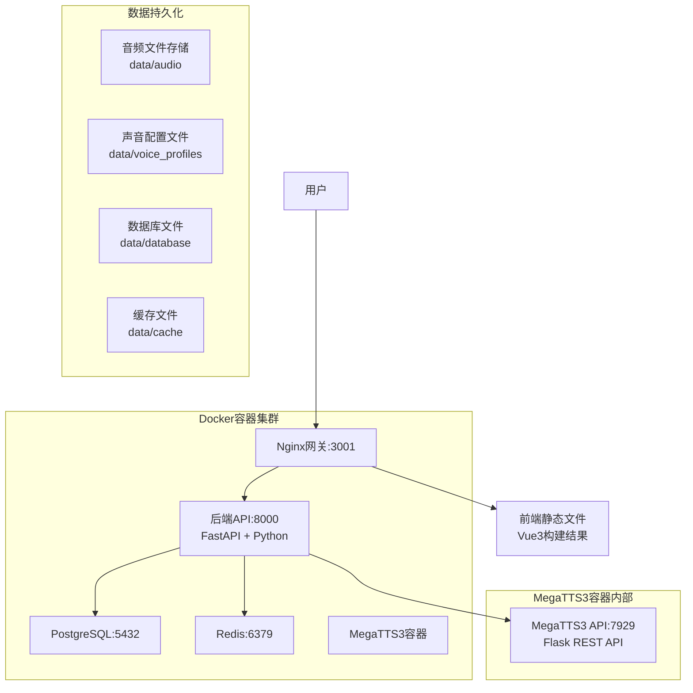

# 🎵 AI-Sound

AI-Sound 是一个基于 MegaTTS3 的企业级语音合成平台，提供高质量的语音克隆和多角色朗读服务。

> 🚀 **新手开发者？** 查看 [快速开始指南](QUICK_START.md) 5分钟上手开发！

## ✨ 项目特点

- **🚀 MegaTTS3引擎**：集成最新的 MegaTTS3 语音合成引擎
- **🎭 智能角色分配**：基于角色名称自动分配合适的声音类型
- **📖 多角色朗读**：支持小说文本的智能分段和多角色语音合成
- **🎵 音频资源库**：统一管理所有生成的音频文件
- **📊 实时监控**：完善的系统状态监控和日志记录
- **🐳 容器化部署**：支持Docker一键部署，生产环境就绪

## 🏗️ 系统架构

### 当前架构（生产部署）



### 网络和端口配置

| 服务 | 容器名 | 内部端口 | 外部端口 | 协议 | 用途 |
|------|--------|----------|----------|------|------|
| Nginx网关 | ai-sound-nginx | 80 | 3001 | HTTP | 前端页面和API网关 |
| 后端API | ai-sound-backend | 8000 | - | HTTP | FastAPI后端服务 |
| PostgreSQL | ai-sound-db | 5432 | - | TCP | 主数据库 |
| Redis | ai-sound-redis | 6379 | - | TCP | 缓存服务 |
| MegaTTS3 API | ai-sound-megatts3 | 7929 | 7929 | HTTP | 语音合成REST API |

## 🚀 快速开始

### 前置要求
- Docker 20.0+
- Docker Compose 2.0+
- 系统内存 ≥ 8GB（MegaTTS3模型需要）
- 磁盘空间 ≥ 20GB
- NVIDIA GPU（可选，用于MegaTTS3加速）

### 🛠️ 开发环境启动（推荐开发者使用）

```bash
# 1. 克隆项目
git clone https://github.com/your-org/AI-Sound.git
cd AI-Sound

# 2. 创建数据目录
mkdir -p data/{audio,database,logs,uploads,voice_profiles,cache,config,backups,temp}

# 3. 构建前端静态文件
cd platform/frontend
npm install
npm run build
cd ../..

# 4. 启动开发环境（支持代码热重载）
scripts\dev-start.bat    # Windows
# 或 scripts/dev-start.sh  # Linux/macOS

# 5. 检查服务状态
scripts\check-code.bat   # 验证代码同步
```

**开发模式特点：**
- ✅ **代码热重载** - 修改后端代码自动生效，无需重建容器
- ✅ **实时调试** - 支持断点调试和详细日志
- ✅ **快速迭代** - 避免Docker构建缓存问题

### 🎯 生产环境部署

```bash
# 启动生产环境
docker-compose up -d

# 等待MegaTTS3模型加载（约2-3分钟）
echo "等待MegaTTS3模型加载完成..."
sleep 180

# 检查服务状态
docker-compose ps
curl http://localhost:3001/api/health
```

### 📊 服务状态检查

```bash
# 检查所有容器状态
docker-compose -f docker-compose.prod.yml ps

# 检查整体健康状态
curl -s http://localhost:3001/api/health | jq

# 检查MegaTTS3 API状态
curl -s http://localhost:7929/api/v1/info | jq

# 查看后端日志
docker logs ai-sound-backend --tail 50

# 查看MegaTTS3日志
docker logs ai-sound-megatts3 --tail 50
```

## 🔧 MegaTTS3配置说明

### 重要说明

MegaTTS3容器运行单一API服务：
- **Flask REST API (7929端口)**：提供完整的语音合成API，包含健康检查

### 自动启动

容器启动时会自动运行 `api_server.py`，无需手动初始化。如需验证：

```bash
# 验证API服务
curl http://localhost:7929/api/v1/info
```

### API端点

MegaTTS3 Flask API提供以下端点：

| 端点 | 方法 | 描述 |
|------|------|------|
| `/health` | GET | 健康检查 |
| `/api/v1/info` | GET | API信息 |
| `/api/v1/tts/synthesize` | POST | 语音合成（返回base64） |
| `/api/v1/tts/synthesize_file` | POST | 语音合成（返回文件） |

### 环境变量

| 变量名 | 默认值 | 描述 |
|--------|--------|------|
| `MEGATTS3_URL` | `http://ai-sound-megatts3:7929` | MegaTTS3 API地址 |
| `API_PORT` | `7929` | MegaTTS3 API端口 |
| `API_HOST` | `0.0.0.0` | MegaTTS3 API监听地址 |

## 🔧 开发指南

### ⚠️ 重要：避免Docker缓存问题

**问题症状：** 修改后端代码后，API行为不变（例如：修复了book_id验证问题，但仍返回"Field required"错误）

**根本原因：** Docker容器使用构建时的代码镜像，本地代码修改不会自动同步到容器内

**解决方案：**

#### 1. 推荐：使用开发模式（自动热重载）
```bash
# Windows
scripts\dev-start.bat

# Linux/macOS  
scripts/dev-start.sh

# 或手动启动
docker-compose -f docker-compose.yml -f docker-compose.dev.yml up -d
```

#### 2. 验证代码是否同步
```bash
# 检查特定代码是否更新
scripts\check-code.bat "book_id.*Optional"

# 检查文件时间戳
scripts\check-code.bat
```

#### 3. 强制重建容器（最后手段）
```bash
# 完全重建
scripts\force-rebuild.bat

# 或手动重建
docker-compose build --no-cache backend
docker-compose restart backend
```

### 🛠️ 开发最佳实践

| 场景 | 推荐方式 | 说明 |
|------|----------|------|
| 日常开发 | 开发模式 | Volume挂载+热重载，代码即时生效 |
| 代码修改 | 开发模式 | 无需重建容器 |
| 依赖变更 | 重建镜像 | requirements.txt或Dockerfile变更时 |
| 问题排查 | 检查脚本 | 验证容器内代码是否为最新 |

### 📋 开发工具脚本

| 脚本 | 功能 | 使用场景 |
|------|------|----------|
| `scripts\dev-start.bat` | 启动开发环境 | 日常开发，支持热重载 |
| `scripts\check-code.bat` | 检查代码同步 | 验证修改是否生效 |
| `scripts\force-rebuild.bat` | 强制重建 | 缓存问题、依赖变更 |

### 🔄 开发流程

1. **启动开发环境**
   ```bash
   scripts\dev-start.bat
   ```

2. **修改代码**
   - 后端代码自动热重载
   - 前端需要重新构建并部署

3. **验证修改**
   ```bash
   scripts\check-code.bat
   # 测试API功能
   ```

4. **问题排查**
   ```bash
   # 查看后端日志
   docker logs ai-sound-backend -f
   
   # 检查容器状态
   docker-compose ps
   ```

详细开发指南请参考：[DEVELOPMENT.md](DEVELOPMENT.md)

## 🐛 问题排查

### 开发相关问题

#### 1. 代码修改后不生效
**症状：** 修改Python代码后，API行为未变化
**原因：** Docker构建缓存问题
**解决：** 
```bash
# 检查代码是否同步
scripts\check-code.bat

# 使用开发模式
scripts\dev-start.bat

# 或强制重建
scripts\force-rebuild.bat
```

#### 2. API返回"Field required"错误  
**症状：** 创建项目时提示book_id字段必填
**原因：** 容器内代码未更新
**解决：**
```bash
# 验证代码修复
scripts\check-code.bat "book_id.*Optional"

# 如果未同步，强制重建
scripts\force-rebuild.bat
```

### 系统运行问题

#### 1. MegaTTS3语音合成返回错误

**症状**：后端日志显示连接错误或HTTP错误

**解决方案**：
```bash
# 检查MegaTTS3容器状态
docker ps | grep megatts3

# 检查API服务
curl http://localhost:7929/api/v1/info

# 如果服务异常，重启容器
docker-compose -f docker-compose.prod.yml restart megatts3
```

#### 2. 健康检查显示MegaTTS3不健康

**症状**：`/api/health`返回`megatts3: "unhealthy"`

**解决方案**：
```bash
# 检查MegaTTS3容器状态
docker ps | grep megatts3

# 检查容器日志
docker logs ai-sound-megatts3 --tail 50

# 重启MegaTTS3容器
docker-compose -f docker-compose.prod.yml restart megatts3

# 重新初始化API服务器（等待60秒）
sleep 60
docker exec ai-sound-megatts3 pip install flask==3.0.3 flask-cors==5.0.0
docker exec -d ai-sound-megatts3 env API_PORT=8929 python api_server.py
```

#### 3. 网络连接错误

**症状**：`Cannot connect to host ai-sound-megatts3:7929`

**解决方案**：
```bash
# 检查Docker网络
docker network ls | grep ai-sound

# 检查容器网络配置
docker inspect ai-sound-megatts3 | grep NetworkMode

# 确保所有容器在同一网络
docker-compose -f docker-compose.prod.yml down
docker-compose -f docker-compose.prod.yml up -d
```

#### 4. 端口冲突

**症状**：`Port 7929 is in use by another program`

**解决方案**：
```bash
# 检查端口占用
netstat -tulpn | grep :7929

# 重启相关容器
docker-compose -f docker-compose.prod.yml restart megatts3
```

### 日志分析

```bash
# 后端详细日志
docker logs ai-sound-backend -f

# MegaTTS3容器日志
docker logs ai-sound-megatts3 -f

# Nginx访问日志
docker exec ai-sound-nginx tail -f /var/log/nginx/access.log

# 系统资源监控
docker stats
```

## 🔄 维护操作

### 自动化维护脚本

创建维护脚本 `scripts/maintain_megatts3.sh`：

```bash
#!/bin/bash
# MegaTTS3维护脚本

echo "🔧 开始MegaTTS3维护..."

# 检查容器状态
if ! docker ps | grep -q ai-sound-megatts3; then
    echo "❌ MegaTTS3容器未运行"
    exit 1
fi

# API服务已内置，无需额外安装依赖

# 检查API服务器状态
echo "🔍 检查API服务器状态..."
if curl -s http://localhost:7929/api/v1/info > /dev/null; then
    echo "✅ MegaTTS3 API服务器运行正常"
else
    echo "❌ MegaTTS3 API服务器异常，尝试重启..."
    docker-compose -f docker-compose.prod.yml restart megatts3
    sleep 30
    if curl -s http://localhost:7929/api/v1/info > /dev/null; then
        echo "✅ MegaTTS3 API服务器重启成功"
    else
        echo "❌ MegaTTS3 API服务器重启失败"
        exit 1
    fi
fi

echo "🎉 MegaTTS3维护完成！"
```

### 备份和恢复

```bash
# 数据备份
tar -czf ai-sound-backup-$(date +%Y%m%d).tar.gz data/

# 数据库备份
docker exec ai-sound-db pg_dump -U ai_sound_user ai_sound > backup_$(date +%Y%m%d).sql

# 恢复数据
tar -xzf ai-sound-backup-YYYYMMDD.tar.gz

# 恢复数据库
docker exec -i ai-sound-db psql -U ai_sound_user ai_sound < backup_YYYYMMDD.sql
```

## 📁 项目结构

```
AI-Sound/
├── 📄 docker-compose.yml          # 🏭 主要部署配置  
├── 📄 docker-compose.dev.yml      # 🔧 开发环境覆盖配置
├── 📄 DEVELOPMENT.md               # 📖 详细开发指南
├── 📄 .env.example                # 🔐 环境变量模板
├── 📂 docs/                      # 📚 文档目录
├── 📂 scripts/                   # 🚀 自动化脚本和工具
│   ├── dev-start.bat             # 🛠️ Windows开发环境启动
│   ├── dev-start.sh              # 🛠️ Linux/macOS开发环境启动  
│   ├── check-code.bat            # 🔍 代码同步检查工具
│   ├── force-rebuild.bat         # 🔄 强制重建脚本
│   ├── deploy.sh                 # 🚀 Linux/macOS部署脚本
│   ├── deploy.bat                # 🚀 Windows部署脚本
│   ├── maintain_megatts3.sh      # 🔧 MegaTTS3维护脚本
│   └── README.md                 # 📝 脚本使用文档
├── 📂 docker/                    # 🐳 Docker配置
│   ├── nginx/
│   │   ├── nginx.conf            # 生产Nginx配置
│   │   └── ssl/                  # SSL证书
│   ├── backend/
│   │   └── Dockerfile.correct    # 后端容器镜像
│   └── database/
│       └── init.sql              # 数据库初始化
├── 📂 platform/                  # 💻 应用代码
│   ├── frontend/                 # 🎨 Vue3前端
│   └── backend/                  # ⚙️ FastAPI后端
├── 📂 MegaTTS/MegaTTS3/          # 🎵 MegaTTS3引擎
│   ├── api_server.py             # Flask REST API服务器
│   ├── API_USAGE.md              # API使用文档
│   └── ...                       # 模型和配置文件
├── 📂 data/                      # 💾 数据持久化
│   ├── audio/                    # 生成的音频文件
│   ├── voice_profiles/           # 声音配置文件
│   ├── database/                 # PostgreSQL数据
│   ├── cache/                    # Redis缓存
│   └── logs/                     # 应用日志

```

## 🤝 贡献指南

1. Fork项目
2. 创建功能分支 (`git checkout -b feature/AmazingFeature`)
3. 提交更改 (`git commit -m 'Add some AmazingFeature'`)
4. 推送到分支 (`git push origin feature/AmazingFeature`)
5. 打开Pull Request

## 📄 许可证

本项目采用 MIT 许可证 - 查看 [LICENSE](LICENSE) 文件了解详情。

## 🙏 致谢

- [MegaTTS3](https://github.com/MegaTTS3/MegaTTS3) - 核心语音合成引擎
- [FastAPI](https://fastapi.tiangolo.com/) - 高性能Web框架
- [Vue.js](https://vuejs.org/) - 渐进式JavaScript框架
- [Ant Design Vue](https://antdv.com/) - 企业级UI组件库