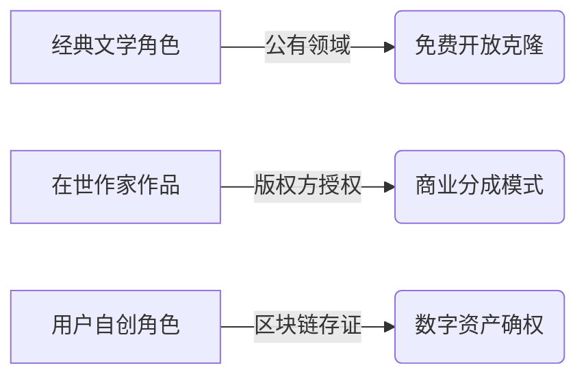

基于小说内容转声音的全流程规划，需突破单纯技术实现维度，从内容理解、艺术表达、用户体验等多个层面构建完整体系。以下为整合性规划框架：

### 一、内容解析与结构重构
1. **文学价值深度挖掘**  
通过NLP技术构建语义图谱，识别核心人物关系、情感曲线与叙事节奏。例如在推理小说中自动标记悬念节点，生成对应语音的停顿与语调变化，使听众同步感知文本张力。

2. **多模态适配策略**  
建立小说类型-声音风格映射矩阵（图1），如玄幻小说匹配史诗感背景音乐与磁性男声，言情小说采用温柔女声+钢琴伴奏。需结合网页7推荐的200种音色库进行动态匹配。


3. **交互式叙事设计**  
开发分支剧情选择系统，用户可通过语音指令改变故事走向（如"让主角选择复仇"），实现类似《隐形守护者》的互动式有声书体验。

### 二、声音工程艺术化升级
1. **情感颗粒度控制**  
采用网页6所述的多层级参数调节体系，包括：
- 基础参数：语速（80-300词/分钟）、音高（80-500Hz）
- 情感参数：悲伤（降调+气声）、紧张（颤音+语速波动）
- 风格参数：方言腔调强度（0-1）、虚实声混合比例

2. **声纹特征提取与管理**  
构建完整声纹特征提取流水线，实现：
- 特征提取：从5-10秒高质量音频中提取声纹特征（.npy文件）
- 质量评估：自动检测声纹特征质量，确保合成效果
- 标准化处理：针对不同采样率和音频质量的自适应处理
- 批量处理：支持多音频同时提取，并自动归类管理

3. **声景空间构建**  
利用Ambisonics技术打造三维声场，实现：
- 人物方位定位（反派声音来自右后方）
- 环境声动态衰减（雨声随场景切换渐变）
- 混响参数自适应（山洞场景增加0.8s尾音延迟）

4. **语音克隆伦理框架**  
建立分级授权体系：


### 三、工业化生产流水线
1. **智能标注系统**  
开发小说语义解析SDK，自动生成SSML标记：
```xml
<speak>
  <mark name="chapter2"/> 
  <prosody rate="slow" pitch="+15%">她颤抖着推开古堡大门</prosody>
  <audio src="creak_door.wav"/>
  <break time="800ms"/>
</speak>
```

2. **分布式渲染集群**  
基于网页5的TTSMaker API构建混合云架构，敏感章节采用本地化部署的PyTorch模型（如网页4的pyttsx3），通用内容调用云端AI引擎。

3. **质量监控体系**  
建立三级品控机制：
- 机器校验（字准率>99.5%）
- AI情感匹配度检测
- 人类审听小组抽样（每10万字抽样3段）

### 四、商业生态构建
1. **创作者经济模型**  
搭建语音创作者的技能认证平台，通过能力雷达图（图2）实现精准供需匹配：


2. **硬件载体创新**  
研发定向声波枕头，实现私人沉浸式听书体验，解决多人共处场景的声音干扰问题。

3. **IP衍生开发**  
将热门有声角色转化为虚拟偶像，通过网页5所述的数字人播报技术进行直播互动，拓展粉丝经济边界。

### 五、声纹角色库构建
1. **角色声音库分层架构**  
建立多层次角色声音库管理系统：
- 基础层：通用声音类型（男/女性，年龄分组）
- 角色层：具体角色声音（主角/配角，特定性格）
- 情感层：同一角色的多种情感变体
- 场景层：特定场景下的声音调整（如电话/广播效果）

2. **角色声纹标签系统**  
实现声纹特征的多维度标记与检索：
```json
{
  "voice_id": "hero_young_male",
  "attributes": {
    "gender": "male",
    "age_group": "young",
    "timbre": "clear",
    "personality": ["brave", "determined"],
    "suitable_genres": ["adventure", "fantasy"]
  },
  "feature_path": "voices/hero_young_male.npy",
  "sample_path": "samples/hero_young_male.wav"
}
```

3. **角色智能切换机制**  
开发自动化角色声音切换功能：
- 对话识别：自动识别小说中的对话与说话者
- 角色映射：将文本角色映射到声音库中的声音
- 平滑过渡：在角色切换时实现自然过渡
- 批量预处理：预先分析整本小说的角色分布

4. **用户自定义声音工作流**  
提供完整的声音定制流程：
- 录制工具：专业录音界面与指导
- 一键提取：简化声纹特征提取过程
- 声音调优：提供多参数调整接口
- 角色库集成：将自定义声音整合到系统中

### 六、伦理与法规沙盒
1. **内容安全机制**  
部署多模态审核系统，实时监测敏感内容并动态降噪处理，如暴力场景自动插入警示音效。

2. **残障友好设计**  
开发视障用户专用控制器，支持触觉反馈调节语速（压力感应）与语调（表面纹理识别）。

该规划突破传统TTS工具局限，构建从文本理解到艺术表达、从技术实现到商业落地的完整生态。建议优先落地情感化语音引擎、声纹特征库与交互叙事模块，具体实施可参考网页1的Python技术栈与网页5的商用API服务。