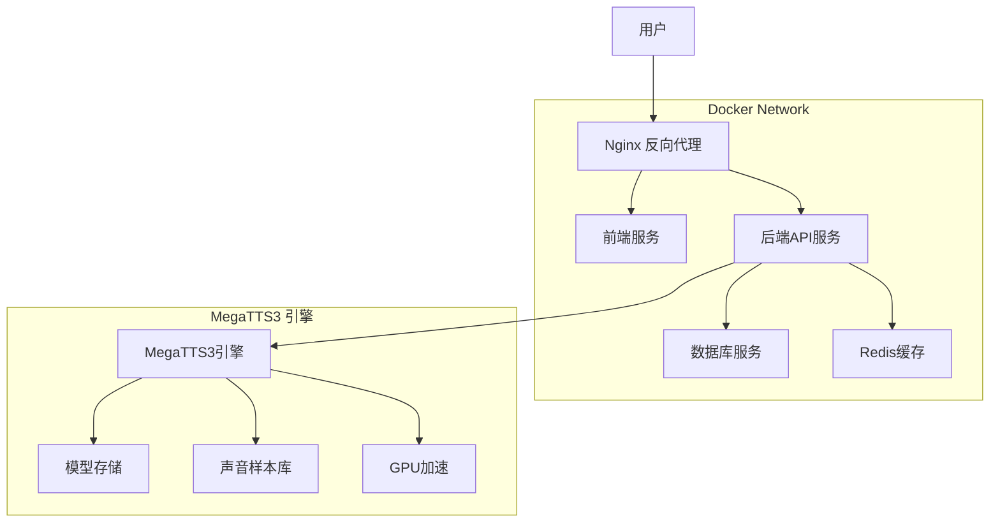

# AI-Sound Platform 容器化部署指南

## 📋 概述

AI-Sound Platform 是基于 MegaTTS3 的语音克隆和多角色朗读平台，支持完整的容器化部署。本文档提供详细的 Docker 部署方案。

## 🏗️ 系统架构

### 服务组件



### 技术栈

| 组件 | 技术 | 版本 | 说明 |
|------|------|------|------|
| 前端 | Vue 3 + Ant Design Vue | 4.x | 响应式用户界面 |
| 后端 | FastAPI + Python | 3.11 | RESTful API服务 |
| 数据库 | SQLite/PostgreSQL | 15 | 数据持久化 |
| 缓存 | Redis | 7 | 性能优化 |
| 代理 | Nginx | Alpine | 负载均衡与静态资源 |
| **TTS引擎** | **MegaTTS3** | **1.0.0** | **核心语音合成引擎** |
| **GPU加速** | **CUDA** | **12.1+** | **深度学习推理加速** |
| 容器 | Docker + Docker Compose | Latest | 容器编排 |

## 🚀 快速开始

### 前置要求

- Docker 20.0+
- Docker Compose 2.0+
- **NVIDIA Container Toolkit** (GPU支持)
- 系统内存 ≥ 8GB (含MegaTTS3)
- 磁盘空间 ≥ 20GB (含模型文件)
- **NVIDIA GPU** (推荐GTX 1080Ti或更高)

### 一键部署

```bash
# 1. 克隆项目
git clone <repository-url>
cd AI-Sound

# 2. 创建数据目录（包含MegaTTS3）
mkdir -p data/{audio,database,logs,uploads,voice_profiles,cache,config}
mkdir -p MegaTTS/MegaTTS3/{checkpoints,storage/voices,storage/cache,logs}

# 3. 配置环境变量
cp .env.example .env
# 编辑 .env 文件，设置必要的配置

# 4. 启动服务（包含MegaTTS3）
docker-compose -f docker-compose.yml -f docker-compose.megatts3.yml up -d

# 5. 查看服务状态
docker-compose ps

# 6. 查看日志
docker-compose logs -f
```

### 访问地址

- **前端界面**: http://localhost
- **API文档**: http://localhost/docs
- **健康检查**: http://localhost/health
- **MegaTTS3 API**: http://localhost:9000/health

## 📁 目录结构

```
AI-Sound/
├── docker-compose.yml          # 主要服务编排
├── docker-compose.megatts3.yml # MegaTTS3服务编排 🔥
├── .env.example               # 环境变量模板
├── .env                       # 环境变量配置
├── docs/                      # 文档目录
│   ├── deployment.md          # 部署文档
│   ├── api.md                 # API文档
│   ├── megatts3-integration.md # MegaTTS3集成文档 🔥
│   └── troubleshooting.md     # 故障排查
├── docker/                    # Docker配置
│   ├── nginx/
│   │   ├── nginx.conf         # Nginx配置
│   │   └── ssl/               # SSL证书
│   ├── database/
│   │   └── init.sql           # 数据库初始化
│   └── megatts3/              # MegaTTS3配置 🔥
│       ├── Dockerfile         # MegaTTS3镜像
│       ├── docker-compose.yml # 独立编排文件
│       └── configs/           # 配置文件
├── MegaTTS/                   # MegaTTS3引擎 🔥
│   └── MegaTTS3/
│       ├── api_server.py      # API服务器
│       ├── requirements.txt   # Python依赖
│       ├── checkpoints/       # 模型权重文件
│       │   ├── dit_base/
│       │   └── dit_large/
│       ├── storage/           # 声音样本存储
│       │   ├── voices/
│       │   └── cache/
│       ├── configs/           # 引擎配置
│       │   ├── model_config.yaml
│       │   └── api_config.yaml
│       └── logs/              # 引擎日志
├── platform/                 # 应用代码
│   ├── frontend/
│   │   ├── Dockerfile         # 前端镜像
│   │   └── ...
│   └── backend/
│       ├── Dockerfile         # 后端镜像
│       ├── requirements.txt   # Python依赖
│       ├── app/
│       │   ├── megatts3_client.py # MegaTTS3客户端 🔥
│       │   └── ...
│       └── ...
├── scripts/                   # 自动化脚本
│   ├── start.sh              # 一键启动脚本
│   ├── megatts3_health.sh    # MegaTTS3健康检查 🔥
│   └── backup.sh             # 备份脚本
└── data/                      # 数据持久化 🔥
    ├── audio/                 # 音频文件
    ├── database/              # 数据库文件
    ├── logs/                  # 日志文件
    ├── uploads/               # 上传文件
    ├── voice_profiles/        # 声音配置
    ├── cache/                 # 缓存数据
    └── config/                # 配置文件
```

## ⚙️ 配置详解

### 环境变量配置

创建 `.env` 文件：

```bash
# 基础配置
COMPOSE_PROJECT_NAME=ai-sound
NODE_ENV=production
DEBUG=false

# 数据库配置
DATABASE_TYPE=sqlite  # sqlite | postgres
DATABASE_URL=sqlite:////app/data/database/ai_sound.db

# PostgreSQL配置（如果使用）
POSTGRES_DB=ai_sound
POSTGRES_USER=ai_sound_user
POSTGRES_PASSWORD=your_secure_password

# MegaTTS3引擎配置 🔥
MEGATTS3_URL=http://host.docker.internal:9000
MEGATTS3_API_KEY=your_api_key
MEGATTS3_MODEL_PATH=/app/checkpoints/dit_base
MEGATTS3_GPU_DEVICE=0
MEGATTS3_WORKERS=2
MEGATTS3_BATCH_SIZE=1
MEGATTS3_CACHE_SIZE=2GB

# 安全配置
SECRET_KEY=your_secret_key_here
CORS_ORIGINS=http://localhost,https://yourdomain.com

# 服务端口
NGINX_HTTP_PORT=80
NGINX_HTTPS_PORT=443
BACKEND_PORT=8000
REDIS_PORT=6379
MEGATTS3_PORT=9000
```

### MegaTTS3 专用配置

**创建 `docker-compose.megatts3.yml`**:

```yaml
version: '3.8'

services:
  megatts3:
    build:
      context: ./MegaTTS/MegaTTS3
      dockerfile: Dockerfile
    container_name: ai-sound-megatts3
    environment:
      - CUDA_VISIBLE_DEVICES=${MEGATTS3_GPU_DEVICE:-0}
      - API_HOST=0.0.0.0
      - API_PORT=9000
      - MODEL_PATH=${MEGATTS3_MODEL_PATH}
      - WORKERS=${MEGATTS3_WORKERS:-2}
      - BATCH_SIZE=${MEGATTS3_BATCH_SIZE:-1}
      - CACHE_SIZE=${MEGATTS3_CACHE_SIZE:-2GB}
      - LOG_LEVEL=INFO
    volumes:
      - ./MegaTTS/MegaTTS3/checkpoints:/app/checkpoints:ro
      - ./MegaTTS/MegaTTS3/storage:/app/storage
      - ./MegaTTS/MegaTTS3/logs:/app/logs
      - ./data/voice_profiles:/app/voice_profiles
    ports:
      - "${MEGATTS3_PORT:-9000}:9000"
    restart: unless-stopped
    deploy:
      resources:
        reservations:
          devices:
            - driver: nvidia
              count: 1
              capabilities: [gpu]
        limits:
          memory: 8G
          cpus: '4'
    networks:
      - ai-sound-network
    healthcheck:
      test: ["CMD", "curl", "-f", "http://localhost:9000/health"]
      interval: 30s
      timeout: 15s
      retries: 3
      start_period: 120s
    depends_on:
      - redis

networks:
  ai-sound-network:
    driver: bridge
```

### Nginx配置更新

在 `docker/nginx/nginx.conf` 中添加 MegaTTS3 代理：

```nginx
worker_processes auto;
error_log /var/log/nginx/error.log warn;
pid /var/run/nginx.pid;

events {
    worker_connections 1024;
    use epoll;
    multi_accept on;
}

http {
    include /etc/nginx/mime.types;
    default_type application/octet-stream;
    
    # 日志格式
    log_format main '$remote_addr - $remote_user [$time_local] "$request" '
                    '$status $body_bytes_sent "$http_referer" '
                    '"$http_user_agent" "$http_x_forwarded_for"';
    
    access_log /var/log/nginx/access.log main;
    
    # 基础配置
    sendfile on;
    tcp_nopush on;
    tcp_nodelay on;
    keepalive_timeout 65;
    types_hash_max_size 2048;
    client_max_body_size 100M;
    
    # Gzip压缩
    gzip on;
    gzip_vary on;
    gzip_min_length 1024;
    gzip_types text/plain text/css text/xml text/javascript 
               application/javascript application/xml+rss 
               application/json;
    
    # 上游服务定义
    upstream frontend {
        server frontend:80;
        keepalive 32;
    }
    
    upstream backend {
        server backend:8000;
        keepalive 32;
    }
    
    # 主服务器配置
    server {
        listen 80;
        server_name _;
        
        # 安全头
        add_header X-Frame-Options DENY;
        add_header X-Content-Type-Options nosniff;
        add_header X-XSS-Protection "1; mode=block";
        
        # 前端静态资源
        location / {
            proxy_pass http://frontend;
            proxy_set_header Host $host;
            proxy_set_header X-Real-IP $remote_addr;
            proxy_set_header X-Forwarded-For $proxy_add_x_forwarded_for;
            proxy_set_header X-Forwarded-Proto $scheme;
        }
        
        # API接口代理
        location /api/ {
            proxy_pass http://backend;
            proxy_set_header Host $host;
            proxy_set_header X-Real-IP $remote_addr;
            proxy_set_header X-Forwarded-For $proxy_add_x_forwarded_for;
            proxy_set_header X-Forwarded-Proto $scheme;
            proxy_buffering off;
            proxy_request_buffering off;
        }
        
        # 音频文件直接服务
        location /audio/ {
            alias /usr/share/nginx/audio/;
            expires 1d;
            add_header Cache-Control "public, immutable";
            add_header Access-Control-Allow-Origin "*";
        }
        
        # 健康检查
        location /health {
            access_log off;
            return 200 "healthy\n";
            add_header Content-Type text/plain;
        }

        # MegaTTS3 API代理
        location /tts/ {
            proxy_pass http://megatts3:9000/;
            proxy_set_header Host $host;
            proxy_set_header X-Real-IP $remote_addr;
            proxy_set_header X-Forwarded-For $proxy_add_x_forwarded_for;
            proxy_set_header X-Forwarded-Proto $scheme;
            proxy_buffering off;
            proxy_request_buffering off;
            proxy_connect_timeout 30s;
            proxy_send_timeout 600s;  # 语音合成可能需要较长时间
            proxy_read_timeout 600s;
            client_max_body_size 100M;  # 支持大文件上传
        }

        # MegaTTS3 健康检查
        location /tts/health {
            proxy_pass http://megatts3:9000/health;
            access_log off;
        }
    }
}
```

## 🔧 MegaTTS3 集成

### 后端集成

**创建 `platform/backend/app/megatts3_client.py`**:

```python
import httpx
import asyncio
from typing import Optional, Dict, Any
import logging

logger = logging.getLogger(__name__)

class MegaTTS3Client:
    def __init__(self, base_url: str = "http://megatts3:9000"):
        self.base_url = base_url
        self.client = httpx.AsyncClient(timeout=600.0)
    
    async def health_check(self) -> Dict[str, Any]:
        """检查MegaTTS3服务健康状态"""
        try:
            response = await self.client.get(f"{self.base_url}/health")
            response.raise_for_status()
            return response.json()
        except Exception as e:
            logger.error(f"MegaTTS3健康检查失败: {e}")
            return {"status": "unhealthy", "error": str(e)}
    
    async def synthesize_speech(
        self,
        text: str,
        voice_id: Optional[str] = None,
        voice_file: Optional[bytes] = None,
        **params
    ) -> bytes:
        """语音合成"""
        try:
            if voice_file:
                # 使用上传的声音文件
                files = {
                    "voice_file": voice_file,
                    "text": text
                }
                for key, value in params.items():
                    files[key] = str(value)
                
                response = await self.client.post(
                    f"{self.base_url}/api/v1/tts/synthesize_file",
                    files=files
                )
            else:
                # 使用预定义的声音ID
                data = {
                    "text": text,
                    "voice_id": voice_id,
                    "parameters": params
                }
                response = await self.client.post(
                    f"{self.base_url}/api/v1/tts/synthesize",
                    json=data
                )
            
            response.raise_for_status()
            return response.content
            
        except Exception as e:
            logger.error(f"语音合成失败: {e}")
            raise
    
    async def close(self):
        """关闭客户端连接"""
        await self.client.aclose()

# 全局客户端实例
megatts3_client = MegaTTS3Client()
```

### 服务启动顺序

修改启动脚本以确保正确的服务依赖关系：

```bash
#!/bin/bash
# scripts/start_with_megatts3.sh

echo "🚀 启动AI-Sound Platform (包含MegaTTS3)"

# 1. 启动基础服务
echo "📂 启动数据库和缓存..."
docker-compose up -d database redis

# 2. 等待基础服务就绪
echo "⏳ 等待基础服务启动..."
sleep 10

# 3. 启动MegaTTS3引擎
echo "🎤 启动MegaTTS3引擎..."
docker-compose -f docker-compose.megatts3.yml up -d

# 4. 等待MegaTTS3就绪
echo "⏳ 等待MegaTTS3引擎启动..."
sleep 30

# 5. 检查MegaTTS3健康状态
echo "🔍 检查MegaTTS3健康状态..."
max_attempts=10
attempt=0
while [ $attempt -lt $max_attempts ]; do
    if curl -f http://localhost:9000/health &> /dev/null; then
        echo "✅ MegaTTS3引擎就绪"
        break
    fi
    
    attempt=$((attempt + 1))
    echo "⏳ 等待MegaTTS3引擎... ($attempt/$max_attempts)"
    sleep 10
done

if [ $attempt -eq $max_attempts ]; then
    echo "❌ MegaTTS3引擎启动超时"
    exit 1
fi

# 6. 启动Platform服务
echo "🌐 启动Platform服务..."
docker-compose up -d backend frontend nginx

echo "🎉 所有服务启动完成！"
echo "访问地址:"
echo "  - 前端界面: http://localhost"
echo "  - API文档: http://localhost/docs" 
echo "  - MegaTTS3: http://localhost:9000/health"
```

## 🔧 服务管理

### 常用命令

```bash
# 启动所有服务（包含MegaTTS3）
docker-compose -f docker-compose.yml -f docker-compose.megatts3.yml up -d

# 启动特定服务
docker-compose up -d nginx backend
docker-compose -f docker-compose.megatts3.yml up -d megatts3

# 停止服务
docker-compose down
docker-compose -f docker-compose.megatts3.yml down

# 重启服务
docker-compose restart
docker-compose -f docker-compose.megatts3.yml restart megatts3

# 查看服务状态
docker-compose ps
docker-compose -f docker-compose.megatts3.yml ps

# 查看实时日志
docker-compose logs -f
docker-compose -f docker-compose.megatts3.yml logs -f megatts3

# 进入容器调试
docker-compose exec backend bash
docker-compose -f docker-compose.megatts3.yml exec megatts3 bash

# MegaTTS3专用命令
./scripts/megatts3_health.sh          # 健康检查
docker-compose -f docker-compose.megatts3.yml exec megatts3 nvidia-smi  # GPU状态
```

### MegaTTS3 扩容配置

```yaml
# docker-compose.megatts3-scale.yml
version: '3.8'

services:
  megatts3:
    deploy:
      replicas: 2
    environment:
      - CUDA_VISIBLE_DEVICES=0,1  # 使用多个GPU
    
  megatts3-lb:
    image: nginx:alpine
    volumes:
      - ./docker/nginx/megatts3-lb.conf:/etc/nginx/nginx.conf:ro
    ports:
      - "9000:80"
    depends_on:
      - megatts3
```

## 📊 监控与日志

### 健康检查

所有服务都配置了健康检查：

```bash
# 检查所有服务健康状态
docker-compose ps

# 检查特定服务
curl -f http://localhost/health          # Platform
curl -f http://localhost/api/health      # Backend
curl -f http://localhost:9000/health     # MegaTTS3

# MegaTTS3专用健康检查
curl -f http://localhost:9000/api/v1/info
```

### 日志管理

```bash
# 日志位置
data/logs/
├── nginx/          # Nginx日志
├── backend/        # 后端日志
├── frontend/       # 前端日志
└── megatts3/       # MegaTTS3日志 🔥

MegaTTS/MegaTTS3/logs/
├── api.log         # API日志
├── inference.log   # 推理日志
└── error.log       # 错误日志

# 实时日志监控
tail -f data/logs/megatts3/api.log
tail -f MegaTTS/MegaTTS3/logs/inference.log
```

### GPU监控

```bash
# GPU使用情况
nvidia-smi

# 容器内GPU监控
docker-compose -f docker-compose.megatts3.yml exec megatts3 nvidia-smi

# GPU温度监控
watch -n 1 nvidia-smi --query-gpu=temperature.gpu --format=csv,noheader,nounits
```

## 🔒 安全配置

### MegaTTS3 安全设置

```yaml
# 在 docker-compose.megatts3.yml 中添加安全配置
services:
  megatts3:
    environment:
      - API_KEY=${MEGATTS3_API_KEY}
      - RATE_LIMIT_ENABLED=true
      - RATE_LIMIT_REQUESTS_PER_MINUTE=30
      - MAX_FILE_SIZE=50MB
      - ALLOWED_ORIGINS=${CORS_ORIGINS}
    
    # 只暴露必要的端口到内网
    expose:
      - "9000"
    # ports:  # 注释掉外部端口映射，只通过Nginx代理访问
    #   - "9000:9000"
```

### API密钥配置

```bash
# 生成MegaTTS3 API密钥
export MEGATTS3_API_KEY=$(openssl rand -hex 32)

# 在请求头中使用
curl -H "Authorization: Bearer $MEGATTS3_API_KEY" \
  http://localhost:9000/api/v1/tts/synthesize
```

## 📈 性能优化

### MegaTTS3 性能调优

1. **GPU内存优化**:
```yaml
environment:
  - TORCH_CUDA_ARCH_LIST="8.0"  # 根据GPU架构调整
  - CUDA_LAUNCH_BLOCKING=0
  - CUDA_CACHE_DISABLE=0
  - GPU_MEMORY_FRACTION=0.8
```

2. **模型缓存策略**:
```python
# 在 MegaTTS3 配置中
cache_config = {
    "model_cache_size": "2GB",
    "voice_cache_size": "1GB", 
    "inference_cache_ttl": 3600,
    "preload_models": ["dit_base"]
}
```

3. **批处理优化**:
```yaml
environment:
  - BATCH_SIZE=4              # 增加批处理大小
  - MAX_SEQUENCE_LENGTH=512   # 限制序列长度
  - WORKERS=2                 # 推理worker数量
```

## 🔄 备份与恢复

### MegaTTS3 数据备份

```bash
#!/bin/bash
# scripts/backup_megatts3.sh

BACKUP_DIR="./backups/megatts3/$(date +%Y-%m-%d_%H-%M-%S)"
mkdir -p "$BACKUP_DIR"

# 备份模型文件
echo "备份模型文件..."
tar -czf "$BACKUP_DIR/checkpoints.tar.gz" MegaTTS/MegaTTS3/checkpoints/

# 备份声音样本
echo "备份声音样本..."
tar -czf "$BACKUP_DIR/voices.tar.gz" MegaTTS/MegaTTS3/storage/voices/

# 备份配置文件
echo "备份配置文件..."
cp -r MegaTTS/MegaTTS3/configs "$BACKUP_DIR/"

# 备份数据库中的声音配置
echo "备份声音配置..."
docker-compose exec -T backend python scripts/export_voice_configs.py > "$BACKUP_DIR/voice_configs.json"

echo "MegaTTS3备份完成: $BACKUP_DIR"
```

## 🚨 故障排查

### MegaTTS3 特定问题

1. **GPU内存不足**
```bash
# 清理GPU缓存
docker-compose -f docker-compose.megatts3.yml exec megatts3 python -c "import torch; torch.cuda.empty_cache()"

# 降低批处理大小
docker-compose -f docker-compose.megatts3.yml exec megatts3 \
  bash -c "export BATCH_SIZE=1 && supervisorctl restart megatts3-api"
```

2. **模型加载失败**
```bash
# 检查模型文件完整性
docker-compose -f docker-compose.megatts3.yml exec megatts3 \
  python -c "import torch; print(torch.load('/app/checkpoints/dit_base/model.pt', map_location='cpu').keys())"

# 重新下载模型
./scripts/download_models.sh
```

3. **API连接超时**
```bash
# 检查MegaTTS3服务状态
curl -v http://localhost:9000/health

# 增加超时时间
export MEGATTS3_TIMEOUT=600
docker-compose -f docker-compose.megatts3.yml restart
```

### 性能问题诊断

```bash
# MegaTTS3资源使用
docker stats ai-sound-megatts3

# GPU使用率监控
watch -n 1 "docker-compose -f docker-compose.megatts3.yml exec megatts3 nvidia-smi"

# 推理延迟统计
docker-compose -f docker-compose.megatts3.yml logs megatts3 | grep "synthesis_time" | tail -20
```

## 📞 技术支持

- 📚 文档：`/docs`
- 🎤 **MegaTTS3集成文档**: `docs/megatts3-integration.md`
- 🐛 问题反馈：GitHub Issues
- 💬 技术交流：参见README联系方式

---

**⚠️ 重要提醒：**
- 生产环境请务必配置GPU支持
- MegaTTS3模型文件需要足够的存储空间
- 定期监控GPU温度和内存使用
- 建议使用SSD存储提升模型加载速度
- 设置定期备份计划（包含模型文件） 