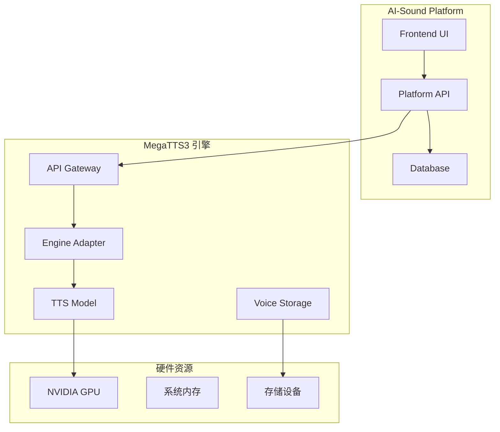

# MegaTTS3 集成与使用指南

## 📋 概述

MegaTTS3 是AI-Sound平台的核心语音合成引擎，采用先进的神经网络架构，支持零样本语音克隆和高质量语音合成。本文档详细介绍MegaTTS3的集成方案、配置方法和使用指南。

## 🏗️ 架构设计

### 整体架构



### 技术栈

| 组件 | 技术 | 版本 | 说明 |
|------|------|------|------|
| 核心引擎 | MegaTTS3 | 1.0.0 | 主要的TTS引擎 |
| 推理框架 | PyTorch | 2.3.0+ | 深度学习框架 |
| CUDA支持 | CUDA | 12.1+ | GPU加速计算 |
| API框架 | FastAPI/Flask | Latest | RESTful API服务 |
| 音频处理 | FFmpeg | 4.0+ | 音频格式转换 |
| 容器化 | Docker | 20.0+ | 服务容器化 |

## 🚀 部署方案

### 方案一：Docker容器部署（推荐）

#### 1. 目录结构

```
AI-Sound/
├── MegaTTS/
│   └── MegaTTS3/                 # MegaTTS3引擎目录
│       ├── Dockerfile            # 引擎容器镜像
│       ├── api_server.py         # API服务器
│       ├── requirements.txt      # Python依赖
│       ├── configs/              # 配置文件
│       │   ├── model_config.yaml
│       │   └── api_config.yaml
│       ├── checkpoints/          # 模型权重
│       │   ├── dit_base/
│       │   └── dit_large/
│       ├── storage/              # 声音样本存储
│       │   ├── voices/
│       │   └── cache/
│       └── logs/                 # 日志文件
└── docker/
    └── megatts3/
        ├── docker-compose.yml    # MegaTTS3编排
        └── nginx.conf            # 代理配置
```

#### 2. Docker配置

**`docker/megatts3/docker-compose.yml`**:
```yaml
version: '3.8'

services:
  megatts3:
    build:
      context: ../../MegaTTS/MegaTTS3
      dockerfile: Dockerfile
    container_name: ai-sound-megatts3
    environment:
      - CUDA_VISIBLE_DEVICES=0
      - API_HOST=0.0.0.0
      - API_PORT=9000
      - MODEL_CACHE_DIR=/app/storage/cache
      - VOICE_STORAGE_DIR=/app/storage/voices
      - LOG_LEVEL=INFO
      - WORKERS=2
    volumes:
      - ../../MegaTTS/MegaTTS3/checkpoints:/app/checkpoints:ro
      - ../../MegaTTS/MegaTTS3/storage:/app/storage
      - ../../MegaTTS/MegaTTS3/logs:/app/logs
      - ../../data/voice_profiles:/app/voice_profiles
    ports:
      - "9000:9000"
    restart: unless-stopped
    deploy:
      resources:
        reservations:
          devices:
            - driver: nvidia
              count: 1
              capabilities: [gpu]
        limits:
          memory: 8G
          cpus: '4'
    networks:
      - ai-sound-network
    healthcheck:
      test: ["CMD", "curl", "-f", "http://localhost:9000/health"]
      interval: 30s
      timeout: 15s
      retries: 3
      start_period: 120s

networks:
  ai-sound-network:
    external: true
```

#### 3. 启动命令

```bash
# 构建MegaTTS3镜像
cd docker/megatts3
docker-compose build

# 启动MegaTTS3服务
docker-compose up -d

# 检查服务状态
docker-compose ps
docker-compose logs -f megatts3
```

### 方案二：本地部署

#### 1. 环境准备

```bash
# 1. 安装Python环境
python -m venv venv
source venv/bin/activate  # Linux/Mac
# 或 venv\Scripts\activate  # Windows

# 2. 安装依赖
cd MegaTTS/MegaTTS3
pip install -r requirements.txt

# 3. 安装CUDA支持（可选）
pip install torch torchvision torchaudio --index-url https://download.pytorch.org/whl/cu121
```

#### 2. 模型下载

```bash
# 创建模型目录
mkdir -p checkpoints/dit_base

# 下载预训练模型（示例）
wget -O checkpoints/dit_base/model.pt "https://example.com/dit_base_model.pt"
wget -O checkpoints/dit_base/config.yaml "https://example.com/dit_base_config.yaml"
```

#### 3. 启动服务

```bash
# 启动API服务
python api_server.py

# 或使用配置文件启动
python api_server.py --config configs/api_config.yaml
```

## ⚙️ 配置详解

### 1. 模型配置

**`configs/model_config.yaml`**:
```yaml
model:
  name: "MegaTTS3-DIT"
  type: "diffusion_transformer"
  version: "1.0.0"
  
  # 模型路径
  checkpoint_path: "/app/checkpoints/dit_base/model.pt"
  config_path: "/app/checkpoints/dit_base/config.yaml"
  
  # 推理参数
  inference:
    device: "cuda:0"           # 使用的设备
    precision: "fp16"          # 推理精度
    batch_size: 1              # 批处理大小
    max_length: 1000           # 最大文本长度
    
  # 声码器配置
  vocoder:
    type: "WaveVAE"
    checkpoint_path: "/app/checkpoints/wavevae/model.pt"
    
  # 缓存配置
  cache:
    enabled: true
    max_size: "2GB"
    ttl: 3600                  # 缓存过期时间（秒）
```

### 2. API配置

**`configs/api_config.yaml`**:
```yaml
api:
  host: "0.0.0.0"
  port: 9000
  workers: 2
  timeout: 300
  max_request_size: "100MB"
  
  # 跨域配置
  cors:
    enabled: true
    origins: ["*"]
    methods: ["GET", "POST"]
    headers: ["*"]
  
  # 限流配置
  rate_limit:
    enabled: true
    requests_per_minute: 30
    burst_size: 10
  
  # 监控配置
  monitoring:
    enabled: true
    metrics_port: 9090
    health_check_interval: 30

# 日志配置
logging:
  level: "INFO"
  format: "%(asctime)s [%(levelname)s] %(message)s"
  file: "/app/logs/megatts3.log"
  max_size: "100MB"
  backup_count: 5
  
# 存储配置
storage:
  voice_samples_dir: "/app/storage/voices"
  cache_dir: "/app/storage/cache"
  temp_dir: "/app/storage/temp"
  max_voice_file_size: "50MB"
  supported_formats: ["wav", "mp3", "flac", "m4a"]
```

### 3. 环境变量

```bash
# 基础配置
export MEGATTS3_HOST=0.0.0.0
export MEGATTS3_PORT=9000
export MEGATTS3_WORKERS=2

# GPU配置
export CUDA_VISIBLE_DEVICES=0
export TORCH_CUDA_ARCH_LIST="8.0"  # 根据GPU架构调整

# 路径配置
export MEGATTS3_MODEL_DIR=/app/checkpoints
export MEGATTS3_STORAGE_DIR=/app/storage
export MEGATTS3_LOG_DIR=/app/logs

# 性能配置
export OMP_NUM_THREADS=4
export TORCH_THREADS=4
export TOKENIZERS_PARALLELISM=false
```

## 🔧 使用指南

### 1. API接口

#### 健康检查

```bash
curl http://localhost:9000/health
```

**响应**:
```json
{
  "status": "healthy",
  "version": "1.0.0",
  "model_loaded": true,
  "gpu_available": true,
  "memory_usage": {
    "total": "8GB",
    "used": "2.1GB",
    "free": "5.9GB"
  }
}
```

#### 语音合成

```bash
curl -X POST http://localhost:9000/api/v1/tts/synthesize \
  -H "Content-Type: application/json" \
  -d '{
    "text": "你好，这是MegaTTS3语音合成测试。",
    "voice_id": "voice_001",
    "parameters": {
      "speed": 1.0,
      "pitch": 1.0,
      "emotion": "neutral"
    }
  }' \
  --output output.wav
```

#### 文件上传合成

```bash
curl -X POST http://localhost:9000/api/v1/tts/synthesize_file \
  -F "text=你好世界" \
  -F "voice_file=@reference_voice.wav" \
  -F "voice_latent=@reference_voice.npy" \
  -F "speed=1.0" \
  --output result.wav
```

### 2. Python客户端

```python
import requests
import json
from pathlib import Path

class MegaTTS3Client:
    def __init__(self, base_url="http://localhost:9000"):
        self.base_url = base_url
        self.session = requests.Session()
    
    def health_check(self):
        """健康检查"""
        response = self.session.get(f"{self.base_url}/health")
        return response.json()
    
    def synthesize_text(self, text, voice_id, **params):
        """文本语音合成"""
        data = {
            "text": text,
            "voice_id": voice_id,
            "parameters": params
        }
        
        response = self.session.post(
            f"{self.base_url}/api/v1/tts/synthesize",
            json=data,
            stream=True
        )
        
        return response.content
    
    def synthesize_with_voice_file(self, text, voice_file_path, latent_file_path=None, **params):
        """使用音频文件进行语音克隆"""
        files = {
            'voice_file': open(voice_file_path, 'rb'),
            'text': (None, text)
        }
        
        if latent_file_path:
            files['voice_latent'] = open(latent_file_path, 'rb')
        
        for key, value in params.items():
            files[key] = (None, str(value))
        
        try:
            response = self.session.post(
                f"{self.base_url}/api/v1/tts/synthesize_file",
                files=files,
                stream=True
            )
            
            return response.content
        finally:
            # 关闭文件句柄
            for file_obj in files.values():
                if hasattr(file_obj, 'close'):
                    file_obj.close()

# 使用示例
client = MegaTTS3Client()

# 检查服务状态
health = client.health_check()
print(f"服务状态: {health['status']}")

# 语音合成
audio_data = client.synthesize_text(
    text="欢迎使用MegaTTS3语音合成服务",
    voice_id="voice_001",
    speed=1.0,
    pitch=1.0
)

# 保存音频文件
with open("output.wav", "wb") as f:
    f.write(audio_data)

print("语音合成完成，已保存到 output.wav")
```

### 3. 声音管理

#### 上传声音样本

```python
def upload_voice_sample(client, voice_id, voice_file, description=""):
    """上传声音样本"""
    files = {
        'voice_file': open(voice_file, 'rb'),
        'voice_id': (None, voice_id),
        'description': (None, description)
    }
    
    response = client.session.post(
        f"{client.base_url}/api/v1/voices/upload",
        files=files
    )
    
    return response.json()

# 使用示例
result = upload_voice_sample(
    client, 
    voice_id="custom_voice_001",
    voice_file="sample_voice.wav",
    description="自定义女声样本"
)
```

#### 获取声音列表

```python
def list_voices(client):
    """获取可用声音列表"""
    response = client.session.get(f"{client.base_url}/api/v1/voices")
    return response.json()

voices = list_voices(client)
for voice in voices['voices']:
    print(f"ID: {voice['id']}, 名称: {voice['name']}, 类型: {voice['type']}")
```

## 📊 性能优化

### 1. GPU优化

```yaml
# GPU内存优化
gpu_config:
  memory_fraction: 0.8          # 限制GPU内存使用
  allow_growth: true            # 动态分配内存
  mixed_precision: true         # 启用混合精度训练
  
# 批处理优化
inference_config:
  batch_size: 4                 # 增加批处理大小
  max_sequence_length: 512      # 限制序列长度
  use_cache: true               # 启用推理缓存
```

### 2. 模型优化

```python
# 模型量化（可选）
import torch

def optimize_model(model_path, output_path):
    """模型优化和量化"""
    model = torch.load(model_path)
    
    # 量化为INT8
    quantized_model = torch.quantization.quantize_dynamic(
        model, {torch.nn.Linear}, dtype=torch.qint8
    )
    
    # 保存优化后的模型
    torch.save(quantized_model, output_path)
    
    return quantized_model
```

### 3. 缓存策略

```python
# Redis缓存配置
cache_config = {
    "redis_url": "redis://localhost:6379",
    "ttl": 3600,                 # 缓存1小时
    "max_memory": "1GB",         # 最大缓存内存
    "compression": True,         # 启用压缩
    "key_prefix": "megatts3:"    # 键前缀
}
```

## 📈 监控与维护

### 1. 监控指标

```python
# 关键性能指标
monitoring_metrics = {
    "synthesis_latency": "语音合成延迟",
    "throughput": "每秒处理请求数",
    "gpu_utilization": "GPU使用率",
    "memory_usage": "内存使用情况",
    "cache_hit_ratio": "缓存命中率",
    "error_rate": "错误率"
}
```

### 2. 日志分析

```bash
# 查看实时日志
tail -f logs/megatts3.log

# 分析错误日志
grep "ERROR" logs/megatts3.log | tail -20

# 性能统计
grep "synthesis_time" logs/megatts3.log | awk '{sum+=$4; count++} END {print "平均合成时间:", sum/count, "秒"}'
```

### 3. 健康检查脚本

```bash
#!/bin/bash
# MegaTTS3 健康检查脚本

MEGATTS3_URL="http://localhost:9000"

# 检查服务状态
check_health() {
    response=$(curl -s -w "%{http_code}" -o /dev/null "$MEGATTS3_URL/health")
    
    if [ "$response" = "200" ]; then
        echo "✅ MegaTTS3 服务正常"
        return 0
    else
        echo "❌ MegaTTS3 服务异常 (HTTP: $response)"
        return 1
    fi
}

# 检查GPU状态
check_gpu() {
    if command -v nvidia-smi &> /dev/null; then
        gpu_memory=$(nvidia-smi --query-gpu=memory.used --format=csv,noheader,nounits | head -1)
        echo "🔧 GPU内存使用: ${gpu_memory}MB"
    else
        echo "⚠️  未检测到NVIDIA GPU"
    fi
}

# 检查磁盘空间
check_disk() {
    disk_usage=$(df -h /app/storage | awk 'NR==2 {print $5}' | sed 's/%//')
    
    if [ "$disk_usage" -gt 80 ]; then
        echo "⚠️  存储空间不足: ${disk_usage}%"
    else
        echo "💾 存储空间充足: ${disk_usage}%"
    fi
}

# 执行检查
echo "🔍 MegaTTS3 健康检查开始..."
check_health
check_gpu
check_disk
echo "✨ 健康检查完成"
```

## 🚨 故障排查

### 常见问题

1. **模型加载失败**
```bash
# 检查模型文件
ls -la checkpoints/
# 检查权限
chmod 644 checkpoints/*.pt
```

2. **GPU内存不足**
```bash
# 清理GPU缓存
python -c "import torch; torch.cuda.empty_cache()"
# 降低批处理大小
export MEGATTS3_BATCH_SIZE=1
```

3. **API连接超时**
```bash
# 增加超时时间
export MEGATTS3_TIMEOUT=600
# 检查网络连接
curl -v http://localhost:9000/health
```

### 诊断命令

```bash
# 服务状态诊断
docker-compose logs megatts3
docker stats ai-sound-megatts3

# 资源使用诊断
nvidia-smi
free -h
df -h

# 网络诊断
netstat -tulpn | grep 9000
telnet localhost 9000
```

## 🔄 版本升级

### 升级流程

```bash
# 1. 备份现有配置
cp -r configs configs.backup.$(date +%Y%m%d)

# 2. 停止服务
docker-compose down

# 3. 更新代码
git pull origin main

# 4. 重新构建镜像
docker-compose build --no-cache

# 5. 启动新版本
docker-compose up -d

# 6. 验证服务
curl http://localhost:9000/health
```

## 📞 技术支持

- 📚 **官方文档**: [MegaTTS3 Documentation](https://github.com/MegaTTS/MegaTTS)
- 🐛 **问题反馈**: GitHub Issues
- 💬 **社区讨论**: [MegaTTS3 Discussions](https://github.com/MegaTTS/MegaTTS/discussions)

---

**⚠️ 重要说明:**
- 生产环境建议使用GPU加速
- 定期备份模型和配置文件  
- 监控GPU温度和内存使用
- 建议使用SSD存储提升I/O性能 