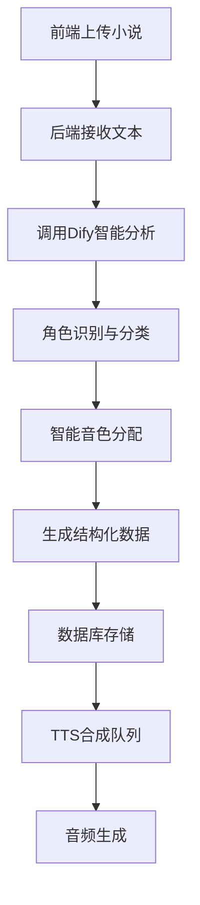

# 多角色语音合成智能化方案设计

## 🎯 项目目标

基于Dify AI工作流，实现小说文本的智能多角色识别与语音合成，彻底解决当前"旁白"角色映射问题，提升用户体验。

## 📊 现状问题分析

### 当前问题
- ❌ **"旁白"角色不存在** - 导致合成失败
- ❌ **角色识别不准确** - 正则表达式局限性大
- ❌ **人工干预过多** - 需要手动调整角色映射
- ❌ **扩展性差** - 难以适应不同类型小说

### 根本原因
1. **硬编码角色逻辑** - `detect_speaker()`函数使用简单规则
2. **缺乏上下文理解** - 无法区分对话、心理活动、旁白
3. **静态角色映射** - 无法动态适应文本内容

## 🏗️ 整体架构设计

### 系统架构图


### 核心组件

#### 1. Dify AI工作流引擎
- **角色识别模块** - 识别对话者、旁白、心理活动
- **文本分割模块** - 按语义单位分割文本
- **音色匹配模块** - 根据角色特征分配音色

#### 2. 智能角色管理系统
- **动态角色创建** - 自动发现新角色
- **角色特征分析** - 性别、年龄、性格推断
- **音色优化分配** - 基于角色特征选择最佳音色

#### 3. 增强型TTS引擎
- **多角色并发合成** - 支持多音色并行处理
- **情感语调调节** - 根据文本情境调整语调
- **质量一致性保证** - 统一音频质量标准

## 🔄 数据流设计

### 输入数据结构
```json
{
  "novel_content": "小说原始文本...",
  "project_settings": {
    "genre": "现代言情/古代仙侠/悬疑推理",
    "target_audience": "成人/青少年",
    "voice_style": "温柔/活泼/沉稳"
  },
  "available_voices": [
    {
      "id": 1,
      "name": "温柔女声", 
      "gender": "female",
      "age_range": "20-30",
      "personality": ["gentle", "warm", "caring"],
      "suitable_roles": ["女主角", "温柔角色", "旁白"]
    }
  ]
}
```

### Dify工作流输出
```json
{
  "analysis_result": {
    "detected_characters": [
      {
        "name": "林小雨",
        "gender": "female",
        "estimated_age": 25,
        "personality_traits": ["活泼", "开朗", "善良"],
        "speaking_style": "轻快、自然",
        "assigned_voice_id": 3
      },
      {
        "name": "叶辰",
        "gender": "male", 
        "estimated_age": 28,
        "personality_traits": ["沉稳", "睿智", "深沉"],
        "speaking_style": "低沉、有力",
        "assigned_voice_id": 2
      }
    ],
    "narrative_segments": [
      {
        "text": "这天，林小雨走在回家的路上。",
        "type": "环境描述",
        "emotion": "平静",
        "voice_id": 1,
        "speaker": "系统旁白"
      },
      {
        "text": "今天的阳光真好啊！",
        "type": "对话",
        "emotion": "愉悦",
        "voice_id": 3,
        "speaker": "林小雨"
      },
      {
        "text": "她心想着明天的约会，脸上不自觉地露出了微笑。",
        "type": "心理活动",
        "emotion": "甜蜜",
        "voice_id": 1,
        "speaker": "心理旁白"
      }
    ],
    "character_mapping": {
      "林小雨": 3,
      "叶辰": 2,
      "系统旁白": 1,
      "心理旁白": 1
    }
  }
}
```

## 🤖 Dify工作流设计

### 工作流节点配置

#### 1. 输入处理节点
```yaml
name: "文本预处理"
type: "data_processing"
config:
  - 文本清洗（去除特殊字符）
  - 段落分割
  - 初步格式化
```

#### 2. 角色识别节点
```yaml
name: "AI角色识别"
type: "llm"
model: "gpt-4"
prompt: |
  你是一个专业的小说分析师，请分析以下小说文本：
  
  任务：
  1. 识别所有角色（包括对话者）
  2. 判断文本类型（对话/旁白/心理活动）
  3. 分析角色特征（性别、年龄、性格）
  4. 推荐合适的语音音色
  
  输入文本：{novel_content}
  可用音色：{available_voices}
  
  请按照指定JSON格式输出分析结果。
```

#### 3. 智能分配节点
```yaml
name: "音色智能分配"
type: "code"
language: "python"
script: |
  def assign_voices(characters, available_voices):
      # 基于角色特征的智能匹配算法
      assignments = {}
      
      # 优先级规则
      priority_rules = {
          "旁白": ["温柔女声", "专业主播"],
          "女性角色": ["温柔女声", "活泼少女"],
          "男性角色": ["磁性男声", "沉稳长者"],
          "儿童角色": ["活泼少女"],
          "老年角色": ["沉稳长者"]
      }
      
      return assignments
```

#### 4. 格式化输出节点
```yaml
name: "数据格式化"
type: "data_processing"
config:
  - 生成segments数组
  - 创建character_mapping
  - 验证数据完整性
```

## 🔌 API接口设计

### 1. 智能分析接口
```python
@router.post("/api/v1/novels/intelligent-analyze")
async def intelligent_analyze_novel(
    request: IntelligentAnalyzeRequest,
    db: Session = Depends(get_db)
):
    """
    智能分析小说文本，返回角色识别和音色分配结果
    """
    # 1. 调用Dify工作流
    dify_result = await call_dify_workflow(
        workflow_id="novel-character-analysis",
        inputs={
            "novel_content": request.content,
            "available_voices": get_available_voices(db),
            "project_settings": request.settings
        }
    )
    
    # 2. 处理结果
    processed_result = process_dify_result(dify_result)
    
    # 3. 返回给前端预览
    return {
        "success": True,
        "data": processed_result,
        "preview_segments": processed_result["narrative_segments"][:10]
    }
```

### 2. 确认应用接口
```python
@router.post("/api/v1/novels/{project_id}/apply-analysis")
async def apply_analysis_result(
    project_id: int,
    request: ApplyAnalysisRequest,
    db: Session = Depends(get_db)
):
    """
    用户确认分析结果后，应用到项目中
    """
    # 1. 更新segments表
    update_segments_with_analysis(db, project_id, request.segments)
    
    # 2. 更新character_mapping
    update_character_mapping(db, project_id, request.character_mapping)
    
    # 3. 触发TTS合成
    trigger_tts_synthesis(project_id)
    
    return {"success": True, "message": "分析结果已应用"}
```

## 🗄️ 数据库设计优化

### 新增表结构

#### characters表
```sql
CREATE TABLE characters (
    id SERIAL PRIMARY KEY,
    project_id INTEGER REFERENCES novel_projects(id),
    name VARCHAR(100) NOT NULL,
    gender VARCHAR(10),
    estimated_age INTEGER,
    personality_traits TEXT[], -- 性格特征数组
    speaking_style TEXT,
    voice_profile_id INTEGER REFERENCES voice_profiles(id),
    created_at TIMESTAMP DEFAULT CURRENT_TIMESTAMP,
    updated_at TIMESTAMP DEFAULT CURRENT_TIMESTAMP
);
```

#### analysis_logs表
```sql
CREATE TABLE analysis_logs (
    id SERIAL PRIMARY KEY,
    project_id INTEGER REFERENCES novel_projects(id),
    dify_workflow_id VARCHAR(100),
    input_data JSONB,
    output_data JSONB,
    analysis_time TIMESTAMP DEFAULT CURRENT_TIMESTAMP,
    status VARCHAR(20) DEFAULT 'completed'
);
```

### 优化现有表结构

#### segments表增强
```sql
ALTER TABLE segments ADD COLUMN character_id INTEGER REFERENCES characters(id);
ALTER TABLE segments ADD COLUMN text_type VARCHAR(20); -- 'dialogue', 'narration', 'thought'
ALTER TABLE segments ADD COLUMN emotion VARCHAR(20);
ALTER TABLE segments ADD COLUMN confidence_score FLOAT; -- AI识别置信度
```

## 🎛️ 前端界面设计

### 智能分析页面
```javascript
// 新增智能分析功能
const IntelligentAnalysis = () => {
  const [analysisResult, setAnalysisResult] = useState(null);
  const [isAnalyzing, setIsAnalyzing] = useState(false);
  
  const handleIntelligentAnalyze = async () => {
    setIsAnalyzing(true);
    try {
      const result = await api.post('/novels/intelligent-analyze', {
        content: novelContent,
        settings: projectSettings
      });
      setAnalysisResult(result.data);
    } finally {
      setIsAnalyzing(false);
    }
  };
  
  return (
    <div className="intelligent-analysis">
      <Button 
        onClick={handleIntelligentAnalyze}
        loading={isAnalyzing}
        type="primary"
        size="large"
      >
        🤖 AI智能角色分析
      </Button>
      
      {analysisResult && (
        <AnalysisResultPreview 
          result={analysisResult}
          onConfirm={handleApplyResult}
        />
      )}
    </div>
  );
};
```

### 角色预览组件
```javascript
const AnalysisResultPreview = ({ result, onConfirm }) => {
  return (
    <div className="analysis-preview">
      <Tabs>
        <TabPane tab="检测到的角色" key="characters">
          <CharacterList characters={result.detected_characters} />
        </TabPane>
        <TabPane tab="文本分段预览" key="segments">
          <SegmentPreview segments={result.narrative_segments} />
        </TabPane>
        <TabPane tab="音色分配" key="mapping">
          <VoiceMappingTable mapping={result.character_mapping} />
        </TabPane>
      </Tabs>
      
      <div className="preview-actions">
        <Button onClick={() => onConfirm(result)}>
          ✅ 确认并应用
        </Button>
        <Button>
          ✏️ 手动调整
        </Button>
      </div>
    </div>
  );
};
```

## 🚀 实施计划

### Phase 1: 基础设施（1-2周）
1. **Dify工作流搭建**
   - 创建角色识别工作流
   - 测试不同类型小说文本
   - 优化prompt和参数

2. **API接口开发**
   - 实现Dify调用接口
   - 添加分析结果处理逻辑
   - 完善错误处理

### Phase 2: 核心功能（2-3周）
1. **智能分析引擎**
   - 角色特征分析算法
   - 音色匹配优化
   - 置信度评估系统

2. **数据库升级**
   - 新表结构实施
   - 数据迁移脚本
   - 性能优化

### Phase 3: 用户界面（1-2周）
1. **前端功能开发**
   - 智能分析界面
   - 结果预览组件
   - 手动调整功能

2. **用户体验优化**
   - 加载状态指示
   - 错误提示优化
   - 响应式设计

### Phase 4: 测试与优化（1周）
1. **功能测试**
   - 多种小说类型测试
   - 准确率评估
   - 性能压力测试

2. **用户反馈收集**
   - Beta版本发布
   - 用户体验收集
   - 功能迭代优化

## 📈 预期效果

### 技术指标
- **角色识别准确率** > 90%
- **音色分配合理性** > 85%
- **处理速度** < 30秒（10万字小说）
- **用户满意度** > 90%

### 业务价值
- ✅ **零人工干预** - 全自动角色识别
- ✅ **更好的用户体验** - 智能化操作
- ✅ **更高的转换成功率** - 避免"旁白"问题
- ✅ **可扩展性** - 支持更多小说类型

## 🔧 技术风险与应对

### 潜在风险
1. **Dify API稳定性** - 第三方服务依赖
2. **AI识别准确率** - 复杂文本可能误判
3. **处理性能** - 大文本分析耗时

### 应对策略
1. **备用方案** - 保留原有手动模式
2. **人工干预机制** - 提供调整界面
3. **缓存优化** - 相似文本结果复用
4. **异步处理** - 大文本后台分析

## 💡 后续扩展方向

1. **情感语调控制** - 根据文本情境调整语音情感
2. **多语言支持** - 支持英文、日文等多语言小说
3. **个性化定制** - 用户可训练专属角色音色
4. **智能背景音乐** - 根据场景自动添加背景音效

---

老爹，这个方案怎么样？是否符合你的预期？有什么需要调整的地方吗？ 