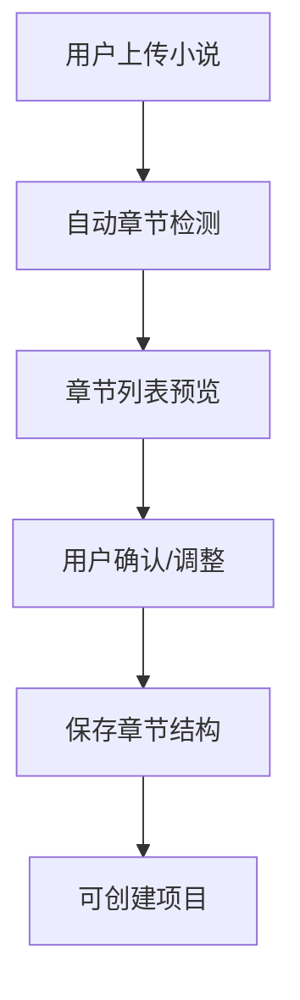
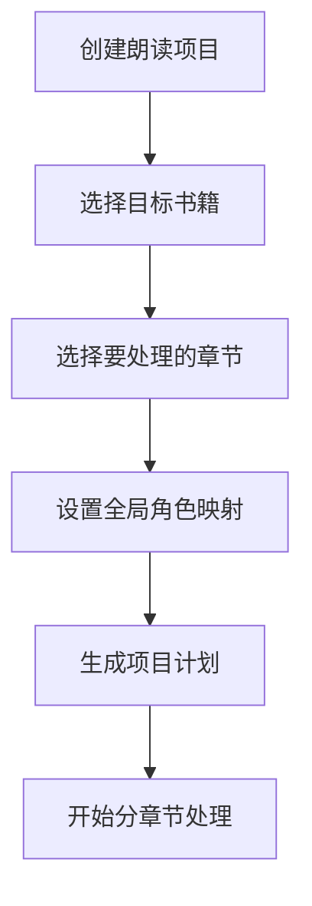
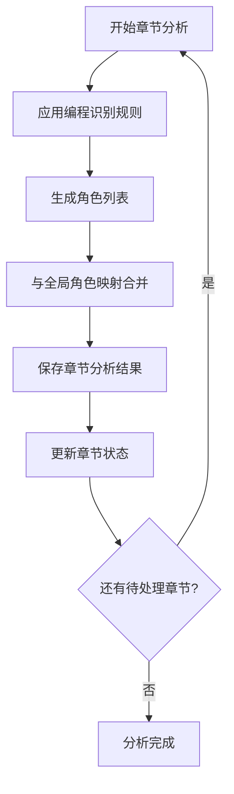
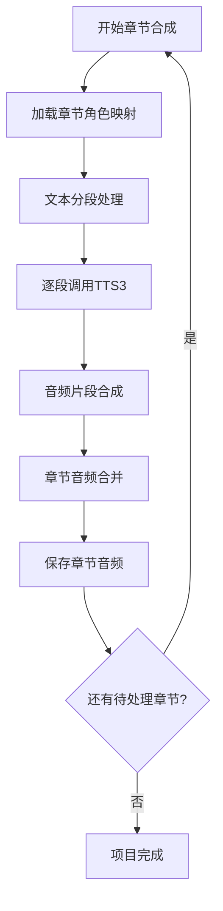

# 小说按章节合成分析方案

**[MODE: ARCHITECTURE]**

## 🎯 问题分析

当前系统存在的问题：
1. **处理规模过大**：一次性处理上万字小说不现实
2. **用户体验差**：无法分章节管理进度  
3. **资源消耗高**：大文本处理消耗内存和时间
4. **错误恢复难**：失败后需要重新开始

## 🏗️ 解决方案：分章节处理架构

### 核心设计理念
- ✅ **章节为单位**：以章节为最小处理单元
- ✅ **增量处理**：支持暂停、继续、重试
- ✅ **并行处理**：多章节可并行分析合成
- ✅ **状态管理**：精确跟踪每章处理状态

## 📋 数据库设计优化

### 1. 章节状态管理
```sql
-- 章节表增强
ALTER TABLE book_chapters ADD COLUMN character_analysis_result TEXT;
ALTER TABLE book_chapters ADD COLUMN synthesis_progress INTEGER DEFAULT 0;
ALTER TABLE book_chapters ADD COLUMN estimated_duration INTEGER;
ALTER TABLE book_chapters ADD COLUMN error_message TEXT;

-- 章节处理状态枚举
-- analysis_status: pending, processing, completed, failed
-- synthesis_status: pending, processing, completed, failed
```

### 2. 项目章节关联
```sql
-- 项目章节表 (管理项目包含哪些章节)
CREATE TABLE project_chapters (
    id INTEGER PRIMARY KEY,
    project_id INTEGER NOT NULL,
    chapter_id INTEGER NOT NULL,
    chapter_order INTEGER NOT NULL,
    character_mapping TEXT, -- 该章节的角色映射
    is_enabled BOOLEAN DEFAULT TRUE,
    created_at TIMESTAMP DEFAULT CURRENT_TIMESTAMP,
    FOREIGN KEY (project_id) REFERENCES novel_projects(id),
    FOREIGN KEY (chapter_id) REFERENCES book_chapters(id)
);
```

## 🔄 处理流程设计

### 阶段1: 书籍导入与章节检测


### 阶段2: 项目创建与章节选择


### 阶段3: 分章节角色分析


### 阶段4: 分章节语音合成


## 💻 API接口设计

### 1. 章节管理接口
```javascript
// 获取书籍章节列表
GET /api/v1/books/{book_id}/chapters
Response: {
  chapters: [
    {
      id: 1,
      chapter_number: 1,
      title: "第一章 初入仙门",
      word_count: 2580,
      analysis_status: "completed",
      synthesis_status: "pending",
      character_count: 8,
      estimated_duration: "3分25秒"
    }
  ]
}

// 分析单个章节
POST /api/v1/chapters/{chapter_id}/analyze
Request: {
  use_global_mapping: true,
  detection_rules: "programming" // 使用编程规则
}
Response: {
  success: true,
  analysis_result: {
    characters: ["唐僧", "悟空", "八戒", "沙僧"],
    segments: [...],
    processing_time: 120 // 毫秒
  }
}

// 合成单个章节
POST /api/v1/chapters/{chapter_id}/synthesize
Request: {
  character_mapping: {
    "唐僧": { voice_id: 1, tts_params: {...} },
    "悟空": { voice_id: 2, tts_params: {...} }
  }
}
```

### 2. 项目章节接口
```javascript
// 创建项目并选择章节
POST /api/v1/projects/create-with-chapters
Request: {
  name: "西游记朗读项目",
  book_id: 1,
  selected_chapters: [1, 2, 3, 4, 5], // 章节ID列表
  global_character_mapping: {...}
}

// 批量处理章节
POST /api/v1/projects/{project_id}/process-chapters
Request: {
  operation: "analyze", // analyze | synthesize | both
  chapter_ids: [1, 2, 3],
  parallel_count: 2,
  continue_on_error: true
}

// 获取项目进度
GET /api/v1/projects/{project_id}/progress
Response: {
  total_chapters: 10,
  completed_analysis: 8,
  completed_synthesis: 5,
  current_processing: ["第3章", "第4章"],
  estimated_remaining: "25分钟"
}
```

## 📊 前端界面设计

### 1. 章节管理页面
```vue
<template>
  <div class="chapter-management">
    <!-- 章节列表 -->
    <a-table :dataSource="chapters" :columns="chapterColumns">
      <template #bodyCell="{ column, record }">
        <template v-if="column.key === 'status'">
          <a-tag :color="getStatusColor(record.analysis_status)">
            {{ getStatusText(record.analysis_status) }}
          </a-tag>
        </template>
        
        <template v-if="column.key === 'actions'">
          <a-space>
            <a-button @click="analyzeChapter(record)" size="small">
              分析
            </a-button>
            <a-button @click="synthesizeChapter(record)" size="small">
              合成
            </a-button>
            <a-button @click="previewChapter(record)" size="small">
              预览
            </a-button>
          </a-space>
        </template>
      </template>
    </a-table>
    
    <!-- 批量操作 -->
    <div class="batch-operations">
      <a-button-group>
        <a-button @click="batchAnalyze">批量分析</a-button>
        <a-button @click="batchSynthesize">批量合成</a-button>
        <a-button @click="batchExport">批量导出</a-button>
      </a-button-group>
    </div>
  </div>
</template>
```

### 2. 项目进度监控
```vue
<template>
  <div class="project-progress">
    <!-- 总体进度 -->
    <a-card title="项目进度总览">
      <a-progress 
        :percent="Math.round(progressData.completed / progressData.total * 100)"
        status="active"
      />
      <p>已完成 {{ progressData.completed }} / {{ progressData.total }} 章节</p>
    </a-card>
    
    <!-- 详细进度 -->
    <a-card title="章节详情">
      <div v-for="chapter in detailedProgress" :key="chapter.id" class="chapter-progress">
        <div class="chapter-header">
          <h4>{{ chapter.title }}</h4>
          <a-tag :color="getStatusColor(chapter.status)">
            {{ chapter.status }}
          </a-tag>
        </div>
        
        <a-progress 
          v-if="chapter.status === 'processing'"
          :percent="chapter.progress"
          size="small"
        />
        
        <div v-if="chapter.error" class="error-message">
          <a-alert :message="chapter.error" type="error" size="small" />
        </div>
      </div>
    </a-card>
  </div>
</template>
```

## 🔧 核心服务实现

### 1. 章节分析服务
```python
class ChapterAnalysisService:
    def __init__(self, character_detector: NovelCharacterDetector):
        self.detector = character_detector
    
    async def analyze_chapter(self, chapter_id: int, config: AnalysisConfig):
        """分析单个章节"""
        chapter = await self.get_chapter(chapter_id)
        
        # 更新状态
        await self.update_chapter_status(chapter_id, "processing")
        
        try:
            # 应用编程识别规则
            result = self.detector.processText(chapter.content)
            
            # 保存分析结果
            await self.save_analysis_result(chapter_id, result)
            
            # 更新状态
            await self.update_chapter_status(chapter_id, "completed")
            
            return result
            
        except Exception as e:
            await self.update_chapter_status(chapter_id, "failed", str(e))
            raise
    
    async def batch_analyze_chapters(self, chapter_ids: List[int], parallel_count: int = 3):
        """批量分析章节"""
        semaphore = asyncio.Semaphore(parallel_count)
        
        async def analyze_with_semaphore(chapter_id):
            async with semaphore:
                return await self.analyze_chapter(chapter_id)
        
        tasks = [analyze_with_semaphore(cid) for cid in chapter_ids]
        results = await asyncio.gather(*tasks, return_exceptions=True)
        
        return results
```

### 2. 章节合成服务
```python
class ChapterSynthesisService:
    def __init__(self, tts_client):
        self.tts_client = tts_client
    
    async def synthesize_chapter(self, chapter_id: int, character_mapping: Dict):
        """合成单个章节"""
        chapter = await self.get_chapter(chapter_id)
        analysis_result = await self.get_analysis_result(chapter_id)
        
        # 更新状态
        await self.update_synthesis_status(chapter_id, "processing")
        
        try:
            audio_segments = []
            total_segments = len(analysis_result.segments)
            
            for i, segment in enumerate(analysis_result.segments):
                # 获取角色音色配置
                voice_config = character_mapping.get(segment.speaker)
                
                # 调用TTS合成
                audio_data = await self.tts_client.synthesize(
                    text=segment.text,
                    voice_id=voice_config.voice_id,
                    tts_params=voice_config.tts_params
                )
                
                audio_segments.append(audio_data)
                
                # 更新进度
                progress = int((i + 1) / total_segments * 100)
                await self.update_synthesis_progress(chapter_id, progress)
            
            # 合并音频
            final_audio = await self.merge_audio_segments(audio_segments)
            
            # 保存音频文件
            audio_url = await self.save_chapter_audio(chapter_id, final_audio)
            
            # 更新状态
            await self.update_synthesis_status(chapter_id, "completed")
            
            return audio_url
            
        except Exception as e:
            await self.update_synthesis_status(chapter_id, "failed", str(e))
            raise
```

## 📈 性能优化策略

### 1. 并行处理
- 支持多章节并行分析
- 章节内段落并行合成
- 音频处理异步化

### 2. 内存管理
- 分段加载大章节内容
- 及时释放音频内存
- 使用流式处理

### 3. 缓存策略
- 角色分析结果缓存
- 音频片段复用缓存
- 配置参数缓存

### 4. 错误恢复
- 断点续传支持
- 失败重试机制
- 部分成功保存

## 🎮 用户使用流程

### 1. 导入小说
1. 上传小说文件
2. 自动检测章节结构
3. 预览并调整章节分割
4. 保存章节数据

### 2. 创建项目
1. 选择目标书籍
2. 选择要处理的章节范围
3. 配置全局角色映射
4. 创建项目

### 3. 分章节处理
1. 选择处理模式（分析/合成/全部）
2. 设置并行处理数量
3. 开始批量处理
4. 实时监控进度

### 4. 结果管理
1. 查看各章节状态
2. 预览分析结果
3. 试听合成音频
4. 调整有问题的章节

---

**总结**：通过分章节处理架构，将大型小说分解为可管理的小单元，实现增量处理、并行优化和精确状态管理，大幅提升处理效率和用户体验。 