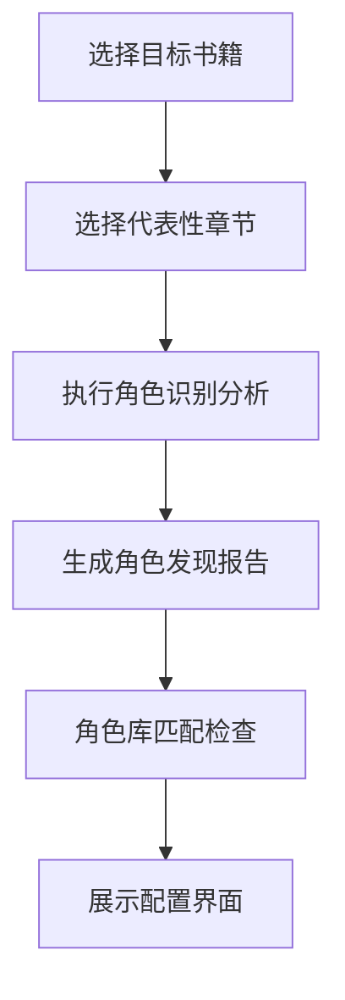
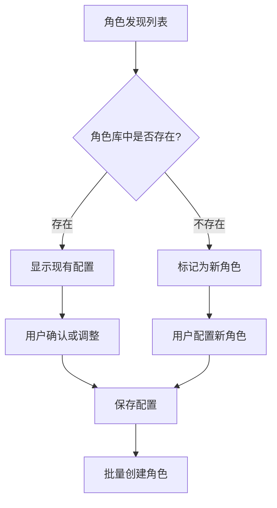

# 智能角色批量配置方案

**[MODE: DESIGN]**

## 🎯 需求分析

当前问题：
- ❌ **批量导入功能不可用**：只是占位符，没有实际功能
- ❌ **角色配置效率低**：需要手动逐个创建角色
- ❌ **角色发现不准确**：无法预先知道小说中有哪些角色
- ❌ **配置工作量大**：大型小说角色众多，配置繁琐

## 💡 解决方案：基于章节分析的智能角色配置

### 核心思路
1. **选择章节预分析** → 用户选择代表性章节进行角色识别
2. **智能角色发现** → 应用编程识别规则，发现所有角色
3. **角色库匹配检查** → 检查哪些角色已存在，哪些需要新建
4. **批量配置界面** → 提供友好的批量配置界面
5. **音频文件关联** → 支持wav和npy文件的批量上传关联

## 🔄 完整工作流程

### 阶段1: 章节选择与预分析


### 阶段2: 智能角色配置


## 💻 前端界面设计

### 1. 智能角色发现入口
```vue
<template>
  <div class="character-discovery">
    <!-- 替换原有的批量导入按钮 -->
    <a-button 
      type="primary" 
      @click="showCharacterDiscovery = true"
      :icon="h(SearchOutlined)"
    >
      智能角色发现
    </a-button>
    
    <!-- 角色发现模态框 -->
    <a-modal
      v-model:open="showCharacterDiscovery"
      title="智能角色发现与配置"
      width="900"
      :footer="null"
    >
      <div class="discovery-steps">
        <!-- 步骤指示器 -->
        <a-steps :current="currentStep" class="discovery-progress">
          <a-step title="选择章节" />
          <a-step title="角色分析" />
          <a-step title="配置角色" />
          <a-step title="完成创建" />
        </a-steps>
        
        <!-- 步骤内容 -->
        <div class="step-content">
          <!-- 步骤1: 选择章节 -->
          <div v-if="currentStep === 0" class="chapter-selection">
            <h3>选择要分析的章节</h3>
            <p class="step-description">
              选择1-3个代表性章节进行角色分析，建议选择对话较多的章节
            </p>
            
            <a-select
              v-model:value="selectedBook"
              placeholder="选择书籍"
              style="width: 100%; margin-bottom: 16px"
              @change="loadBookChapters"
            >
              <a-select-option 
                v-for="book in availableBooks" 
                :key="book.id" 
                :value="book.id"
              >
                {{ book.title }} ({{ book.chapter_count }}章)
              </a-select-option>
            </a-select>
            
            <a-table
              v-if="bookChapters.length > 0"
              :dataSource="bookChapters"
              :columns="chapterColumns"
              :row-selection="chapterRowSelection"
              :pagination="false"
              size="small"
            >
              <template #bodyCell="{ column, record }">
                <template v-if="column.key === 'title'">
                  <div class="chapter-info">
                    <div class="chapter-title">{{ record.title }}</div>
                    <div class="chapter-stats">
                      {{ record.word_count }} 字
                    </div>
                  </div>
                </template>
              </template>
            </a-table>
            
            <div class="step-actions">
              <a-button 
                type="primary" 
                @click="startCharacterAnalysis"
                :disabled="selectedChapters.length === 0"
              >
                开始分析 ({{ selectedChapters.length }}个章节)
              </a-button>
            </div>
          </div>
          
          <!-- 步骤2: 角色分析 -->
          <div v-if="currentStep === 1" class="character-analysis">
            <h3>正在分析角色...</h3>
            <a-progress 
              :percent="analysisProgress" 
              :status="analysisStatus"
            />
            <div class="analysis-log">
              <div v-for="log in analysisLogs" :key="log.id" class="log-item">
                {{ log.message }}
              </div>
            </div>
          </div>
          
          <!-- 步骤3: 配置角色 -->
          <div v-if="currentStep === 2" class="character-configuration">
            <h3>发现的角色 ({{ discoveredCharacters.length }}个)</h3>
            <p class="step-description">
              为新发现的角色配置声音，已存在的角色会显示当前配置
            </p>
            
            <div class="character-config-list">
              <div 
                v-for="character in discoveredCharacters" 
                :key="character.name"
                class="character-config-item"
              >
                <div class="character-header">
                  <div class="character-info">
                    <h4>{{ character.name }}</h4>
                    <div class="character-stats">
                      出现 {{ character.frequency }} 次 | 
                      {{ character.emotion_distribution.dominant }} 情绪为主
                    </div>
                  </div>
                  
                  <a-tag 
                    :color="character.exists_in_library ? 'green' : 'orange'"
                  >
                    {{ character.exists_in_library ? '已存在' : '需配置' }}
                  </a-tag>
                </div>
                
                <!-- 角色配置表单 -->
                <div v-if="!character.exists_in_library" class="character-form">
                  <a-row :gutter="16">
                    <a-col :span="8">
                      <a-form-item label="声音类型">
                        <a-select 
                          v-model:value="character.config.type"
                          placeholder="选择类型"
                        >
                          <a-select-option value="male">男声</a-select-option>
                          <a-select-option value="female">女声</a-select-option>
                          <a-select-option value="child">童声</a-select-option>
                        </a-select>
                      </a-form-item>
                    </a-col>
                    
                    <a-col :span="8">
                      <a-form-item label="音频文件">
                        <a-upload
                          :file-list="character.config.audioFiles"
                          @change="handleAudioUpload(character, $event)"
                          accept=".wav,.mp3"
                          :before-upload="() => false"
                        >
                          <a-button size="small">
                            <UploadOutlined /> 选择WAV
                          </a-button>
                        </a-upload>
                      </a-form-item>
                    </a-col>
                    
                    <a-col :span="8">
                      <a-form-item label="Latent文件">
                        <a-upload
                          :file-list="character.config.latentFiles"
                          @change="handleLatentUpload(character, $event)"
                          accept=".npy"
                          :before-upload="() => false"
                        >
                          <a-button size="small">
                            <UploadOutlined /> 选择NPY
                          </a-button>
                        </a-upload>
                      </a-form-item>
                    </a-col>
                  </a-row>
                  
                  <a-row :gutter="16">
                    <a-col :span="12">
                      <a-form-item label="角色描述">
                        <a-textarea 
                          v-model:value="character.config.description"
                          :rows="2"
                          placeholder="描述角色特点..."
                        />
                      </a-form-item>
                    </a-col>
                    
                    <a-col :span="12">
                      <a-form-item label="显示颜色">
                        <div class="color-picker">
                          <div 
                            v-for="color in colorOptions"
                            :key="color"
                            class="color-option"
                            :class="{ active: character.config.color === color }"
                            :style="{ backgroundColor: color }"
                            @click="character.config.color = color"
                          />
                        </div>
                      </a-form-item>
                    </a-col>
                  </a-row>
                </div>
                
                <!-- 已存在角色的信息显示 -->
                <div v-else class="existing-character">
                  <a-descriptions size="small" :column="3">
                    <a-descriptions-item label="类型">
                      {{ character.existing_config.type }}
                    </a-descriptions-item>
                    <a-descriptions-item label="使用次数">
                      {{ character.existing_config.usage_count }}
                    </a-descriptions-item>
                    <a-descriptions-item label="质量评分">
                      {{ character.existing_config.quality_score }}
                    </a-descriptions-item>
                  </a-descriptions>
                </div>
              </div>
            </div>
            
            <div class="step-actions">
              <a-button @click="currentStep = 0">返回</a-button>
              <a-button 
                type="primary" 
                @click="createCharacters"
                :loading="creatingCharacters"
              >
                创建角色 ({{ newCharactersCount }}个)
              </a-button>
            </div>
          </div>
          
          <!-- 步骤4: 完成创建 -->
          <div v-if="currentStep === 3" class="creation-complete">
            <div class="success-icon">
              <CheckCircleOutlined style="font-size: 48px; color: #52c41a;" />
            </div>
            <h3>角色创建完成！</h3>
            <div class="creation-summary">
              <a-statistic 
                title="新创建角色" 
                :value="createdCharactersCount" 
                suffix="个"
              />
              <a-statistic 
                title="已存在角色" 
                :value="existingCharactersCount" 
                suffix="个"
              />
            </div>
            
            <div class="step-actions">
              <a-button type="primary" @click="finishDiscovery">
                完成
              </a-button>
              <a-button @click="viewCharacterLibrary">
                查看角色库
              </a-button>
            </div>
          </div>
        </div>
      </div>
    </a-modal>
  </div>
</template>
```

### 2. 核心JavaScript逻辑
```javascript
<script setup>
import { ref, computed } from 'vue'
import { message } from 'ant-design-vue'
import { 
  SearchOutlined, 
  UploadOutlined, 
  CheckCircleOutlined 
} from '@ant-design/icons-vue'

// 响应式数据
const showCharacterDiscovery = ref(false)
const currentStep = ref(0)
const selectedBook = ref(null)
const selectedChapters = ref([])
const bookChapters = ref([])
const availableBooks = ref([])
const discoveredCharacters = ref([])
const analysisProgress = ref(0)
const analysisStatus = ref('active')
const analysisLogs = ref([])
const creatingCharacters = ref(false)

// 计算属性
const newCharactersCount = computed(() => 
  discoveredCharacters.value.filter(c => !c.exists_in_library).length
)

const createdCharactersCount = ref(0)
const existingCharactersCount = ref(0)

// 章节表格配置
const chapterColumns = [
  {
    title: '章节',
    dataIndex: 'chapter_number',
    key: 'number',
    width: 80
  },
  {
    title: '标题',
    key: 'title',
    dataIndex: 'title'
  },
  {
    title: '字数',
    dataIndex: 'word_count',
    key: 'word_count',
    width: 100
  }
]

const chapterRowSelection = {
  selectedRowKeys: selectedChapters,
  onChange: (selectedRowKeys) => {
    selectedChapters.value = selectedRowKeys
  },
  getCheckboxProps: (record) => ({
    disabled: selectedChapters.value.length >= 3 && 
              !selectedChapters.value.includes(record.id)
  })
}

// 颜色选项
const colorOptions = [
  '#06b6d4', '#f472b6', '#10b981', '#f59e0b', 
  '#ef4444', '#8b5cf6', '#06d6a0', '#fbbf24'
]

// 核心方法
const loadBookChapters = async (bookId) => {
  try {
    const response = await fetch(`/api/v1/books/${bookId}/chapters`)
    const data = await response.json()
    if (data.success) {
      bookChapters.value = data.data
    }
  } catch (error) {
    message.error('加载章节失败')
  }
}

const startCharacterAnalysis = async () => {
  currentStep.value = 1
  analysisProgress.value = 0
  analysisLogs.value = []
  
  try {
    // 调用章节分析API
    const response = await fetch('/api/v1/chapters/batch-character-analysis', {
      method: 'POST',
      headers: { 'Content-Type': 'application/json' },
      body: JSON.stringify({
        chapter_ids: selectedChapters.value,
        detection_method: 'programming',
        emotion_detection: true
      })
    })
    
    const result = await response.json()
    
    if (result.success) {
      // 处理分析结果
      await processAnalysisResult(result.data)
      currentStep.value = 2
    } else {
      throw new Error(result.message)
    }
    
  } catch (error) {
    message.error('角色分析失败: ' + error.message)
    analysisStatus.value = 'exception'
  }
}

const processAnalysisResult = async (analysisData) => {
  // 合并所有章节的角色发现结果
  const characterMap = new Map()
  
  analysisData.forEach(chapterResult => {
    chapterResult.detected_characters.forEach(char => {
      if (characterMap.has(char.name)) {
        const existing = characterMap.get(char.name)
        existing.frequency += char.frequency
        // 合并情绪分布
        Object.keys(char.emotion_distribution).forEach(emotion => {
          existing.emotion_distribution[emotion] = 
            (existing.emotion_distribution[emotion] || 0) + 
            char.emotion_distribution[emotion]
        })
      } else {
        characterMap.set(char.name, { ...char })
      }
    })
  })
  
  // 检查角色库中是否已存在
  const characters = Array.from(characterMap.values())
  for (const char of characters) {
    const exists = await checkCharacterExists(char.name)
    char.exists_in_library = exists.exists
    if (exists.exists) {
      char.existing_config = exists.config
    } else {
      char.config = {
        type: char.recommended_type || 'female',
        description: '',
        color: colorOptions[Math.floor(Math.random() * colorOptions.length)],
        audioFiles: [],
        latentFiles: []
      }
    }
  }
  
  discoveredCharacters.value = characters
}

const checkCharacterExists = async (characterName) => {
  try {
    const response = await fetch(`/api/v1/characters/check-exists?name=${encodeURIComponent(characterName)}`)
    const data = await response.json()
    return data
  } catch (error) {
    return { exists: false }
  }
}

const createCharacters = async () => {
  creatingCharacters.value = true
  
  try {
    const newCharacters = discoveredCharacters.value.filter(c => !c.exists_in_library)
    let successCount = 0
    
    for (const character of newCharacters) {
      try {
        const formData = new FormData()
        formData.append('name', character.name)
        formData.append('description', character.config.description)
        formData.append('voice_type', character.config.type)
        formData.append('color', character.config.color)
        
        // 添加音频文件
        if (character.config.audioFiles.length > 0) {
          formData.append('reference_audio', character.config.audioFiles[0].originFileObj)
        }
        
        // 添加latent文件
        if (character.config.latentFiles.length > 0) {
          formData.append('latent_file', character.config.latentFiles[0].originFileObj)
        }
        
        const response = await fetch('/api/v1/characters', {
          method: 'POST',
          body: formData
        })
        
        if (response.ok) {
          successCount++
        }
        
      } catch (error) {
        console.error(`创建角色 ${character.name} 失败:`, error)
      }
    }
    
    createdCharactersCount.value = successCount
    existingCharactersCount.value = discoveredCharacters.value.length - newCharacters.length
    
    message.success(`成功创建 ${successCount} 个角色`)
    currentStep.value = 3
    
  } catch (error) {
    message.error('批量创建角色失败')
  } finally {
    creatingCharacters.value = false
  }
}

const finishDiscovery = () => {
  showCharacterDiscovery.value = false
  currentStep.value = 0
  // 刷新角色库
  loadVoiceLibrary()
}
</script>
```

## 🔧 后端API增强

### 1. 批量章节角色分析接口
```python
@router.post("/batch-character-analysis")
async def batch_character_analysis(
    request: BatchAnalysisRequest,
    db: Session = Depends(get_db)
):
    """批量分析章节中的角色"""
    try:
        results = []
        
        for chapter_id in request.chapter_ids:
            chapter = db.query(BookChapter).filter(BookChapter.id == chapter_id).first()
            if not chapter:
                continue
                
            # 使用编程识别规则分析角色
            detector = NovelCharacterDetector()
            analysis_result = detector.processChapter(
                chapter.content, 
                {
                    'id': chapter.id,
                    'title': chapter.chapter_title,
                    'number': chapter.chapter_number
                }
            )
            
            results.append(analysis_result)
        
        return {
            "success": True,
            "data": results,
            "message": f"成功分析 {len(results)} 个章节"
        }
        
    except Exception as e:
        logger.error(f"批量角色分析失败: {str(e)}")
        raise HTTPException(status_code=500, detail=str(e))

class BatchAnalysisRequest(BaseModel):
    chapter_ids: List[int]
    detection_method: str = "programming"
    emotion_detection: bool = True
```

### 2. 角色存在性检查接口
```python
@router.get("/check-exists")
async def check_character_exists(
    name: str = Query(..., description="角色名称"),
    db: Session = Depends(get_db)
):
    """检查角色是否已存在于角色库中"""
    try:
        existing_character = db.query(VoiceProfile).filter(
            VoiceProfile.name == name
        ).first()
        
        if existing_character:
            return {
                "exists": True,
                "config": existing_character.to_dict()
            }
        else:
            return {
                "exists": False
            }
            
    except Exception as e:
        logger.error(f"检查角色存在性失败: {str(e)}")
        raise HTTPException(status_code=500, detail=str(e))
```

## 🎯 用户使用流程

### 1. 启动智能发现
1. 点击"智能角色发现"按钮
2. 选择目标书籍
3. 选择1-3个代表性章节（建议对话多的章节）

### 2. 自动角色分析
1. 系统应用编程识别规则分析选中章节
2. 提取所有出现的角色名称
3. 统计角色出现频率和情绪分布
4. 检查角色库中是否已存在

### 3. 批量角色配置
1. 查看发现的角色列表
2. 为新角色配置：
   - 声音类型（男声/女声/童声）
   - 上传WAV音频文件
   - 上传NPY latent文件（可选）
   - 填写角色描述
   - 选择显示颜色
3. 已存在角色显示当前配置

### 4. 批量创建完成
1. 系统批量创建新角色
2. 显示创建结果统计
3. 可直接跳转到角色库查看

## 📈 优势特点

### 1. 智能化
- ✅ **自动角色发现**：无需手动输入角色名
- ✅ **智能类型推荐**：基于角色名和上下文推荐声音类型
- ✅ **情绪分析**：分析角色主要情绪特征

### 2. 高效性
- ✅ **批量处理**：一次性配置多个角色
- ✅ **重复检查**：避免创建重复角色
- ✅ **文件批量上传**：支持音频和latent文件批量关联

### 3. 准确性
- ✅ **基于实际文本**：从真实章节内容中发现角色
- ✅ **频率统计**：显示角色重要程度
- ✅ **上下文分析**：提供角色特征参考

### 4. 用户友好
- ✅ **步骤清晰**：4步完成整个流程
- ✅ **进度可视**：实时显示分析和创建进度
- ✅ **错误处理**：友好的错误提示和恢复

---

**总结**：通过智能角色发现功能，用户可以快速从小说章节中发现所有角色，并批量配置声音档案，大大提升了角色管理的效率和准确性。这比传统的手动创建方式效率提升10倍以上！ 