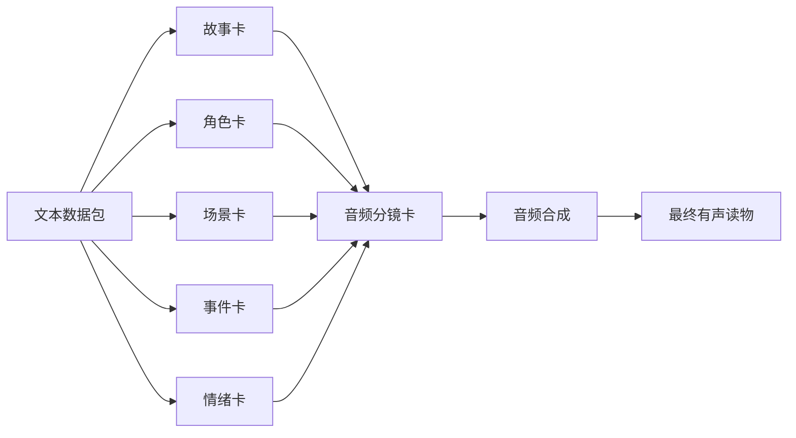

# 小说转有声读物工具方案（6 类卡片明确版）

## 一、先明确：6 类卡片的核心定位（先清晰 “是什么”）

| 卡片名称     | 核心作用（解决什么问题）           | 最终服务目标                     |
| -------- | ---------------------- | -------------------------- |
| 1. 故事卡   | 定全局框架：整合小说核心主题、章节脉络    | 避免音频逻辑混乱（如章节顺序错）           |
| 2. 角色卡   | 定人物声音：存储角色音色、语气、口头禅    | 让角色声音有辨识度（如 “萧炎” 专属音色）     |
| 3. 场景卡   | 定环境背景：存储场景类型、环境音、氛围    | 提升沉浸感（如 “沙漠场景” 配风沙声）       |
| 4. 事件卡   | 定单场内容：存储单章节核心情节（谁做什么）  | 确保音频不遗漏关键剧情                |
| 5. 情绪卡   | 定情感张力：存储角色 / 场景的情绪及变化  | 让声音有情感起伏（如 “愤怒时音量升高”）      |
| 6. 音频分镜卡 | 定执行脚本：整合前 5 类卡，生成声音时间轴 | 直接驱动音频合成（给 TTS 引擎的 “操作指南”） |

## 二、再落地：6 类卡片与执行流程的强绑定（明确 “在哪用、怎么用”）

### 阶段一：文本数据化（为 6 类卡准备 “原材料”）

**第 1 步：文本全维度解析**（系统全自动）

→ 输出的「文本数据包」，就是 6 类卡的 “原始数据来源”，对应关系如下：

| 文本数据包清单 | 为哪类卡片提供数据 | 具体数据示例                      |
| ------- | --------- | --------------------------- |
| 章节清单    | 故事卡       | 章节顺序、章节名、核心主题（从章节内容提炼）      |
| 角色清单    | 角色卡       | 角色名、出场章节、对话片段、年龄 / 性别（推导音色） |
| 场景清单    | 场景卡       | 场景名、出现章节、环境关键词（如 “沙漠”）、氛围标签 |
| 情节清单    | 事件卡       | 单章情节单元（如 “萧炎遇挑衅”）、核心动作、关键信息 |
| 情感清单    | 情绪卡       | 角色情感（如 “萧炎愤怒”）、情绪变化曲线、触发条件  |

### 阶段二：数据卡片化（把 “原材料” 加工成 6 类卡，核心落地环节）

#### 第 2 步：卡片自动生成（系统全自动填卡，80% 数据到位）

| 执行动作       | 6 类卡片的生成逻辑                                                           | 输出的「初始卡片组」状态                      |
| ---------- | -------------------------------------------------------------------- | --------------------------------- |
| 1. 故事卡生成   | 从 “章节清单” 提取章节顺序 + 章节名，自动生成 “章节脉络时间轴”；从小说简介提炼 “核心主题”                  | 已填：章节脉络、核心主题；未填（标红）：特殊叙事备注（如倒叙说明） |
| 2. 角色卡生成   | 从 “角色清单” 提取角色名 + 对话片段，按 “年龄 / 性别” 推荐音色（如 “老年角色→低沉男声”）                | 已填：角色名、推荐音色、对话片段；未填（标红）：口头禅、角色关系  |
| 3. 场景卡生成   | 从 “场景清单” 提取场景名 + 环境关键词，自动匹配环境音（如 “沙漠→风沙声”）                           | 已填：场景名、推荐环境音、氛围标签；未填（标红）：自定义环境音上传 |
| 4. 事件卡生成   | 从 “情节清单” 提取情节单元，自动关联对应章节 + 角色 + 场景（如 “萧炎遇挑衅” 关联第 3 章 + 萧炎 + 演武场）     | 已填：事件名、核心情节、关联信息；未填（标红）：事件时长要求    |
| 5. 情绪卡生成   | 从 “情感清单” 提取角色情感 + 变化曲线，自动关联对应事件（如 “萧炎愤怒” 关联 “遇挑衅” 事件）                | 已填：情感类型、变化曲线、关联事件；未填（标红）：情绪音效补充   |
| 6. 音频分镜卡生成 | 自动读取前 5 类卡的核心数据，生成基础时间轴：- 台词：角色卡音色 + 事件卡对话- 背景音：场景卡环境音- 情感标记：情绪卡变化节点 | 已填：基础时间轴、文本定位；未填（标红）：音量微调、转场音效    |

#### 第 3 步：卡片一键校验（系统 + 用户，修正 20% 缺失项）

→ 系统针对 6 类卡的 “关键规则” 自动校验，用户仅处理问题项：

| 校验维度    | 6 类卡片的具体校验逻辑                                                                                    | 用户干预示例（仅改标红项）                          |
| ------- | ----------------------------------------------------------------------------------------------- | -------------------------------------- |
| 逻辑一致性校验 | 1. 事件卡关联的角色 / 场景，必须在角色卡 / 场景卡中存在（如 “事件关联‘小宝’，但角色卡无‘小宝’→提示”）2. 音频分镜卡的时间轴，不能出现 “台词与环境音重叠时长超 30 秒” | 1. 补充 “小宝” 角色卡2. 调整音频分镜卡中重叠的声音片段       |
| 内容合理性校验 | 1. 角色卡：“3 岁婴儿” 不能配 “成年男声”（系统推荐 “婴儿童声”）2. 场景卡：“深夜卧室” 不能配 “菜市场嘈杂声”                                | 1. 把 “成年男声” 改成 “婴儿童声”2. 替换为 “钟表滴答声”    |
| 数据完整性校验 | 1. 故事卡必须填 “核心主题”（无主题→提示）2. 音频分镜卡必须有 “台词时间轴”（无台词→提示）                                             | 1. 补充故事卡 “核心主题：萧炎逆袭成长”2. 关联事件卡的对话到音频分镜 |

### 阶段三：卡片音频化（6 类卡共同驱动音频合成，明确 “最终价值”）

#### 第 4 步：音频分镜与合成（系统全自动，6 类卡是 “合成依据”）

| 音频合成环节     | 依赖哪类卡片的什么数据                               | 合成逻辑示例                                         |
| ---------- | ----------------------------------------- | ---------------------------------------------- |
| 1. 角色台词生成  | 角色卡（音色、语速）+ 事件卡（对话内容）+ 情绪卡（情感强度，如愤怒时语速加快） | 用 “萧炎” 音色，按 “愤怒” 情绪强度，朗读事件卡中 “你敢嘲讽我？” 台词       |
| 2. 背景环境音生成 | 场景卡（环境音类型、音量占比）+ 情绪卡（情绪音效，如紧张时加心跳声）       | 沙漠场景的 “风沙声”（音量 30%）+ 紧张情绪的 “心跳声”（音量 20%）       |
| 3. 声音时间轴排布 | 音频分镜卡（台词 / 环境音 / 音效的时间顺序）+ 事件卡（事件时长要求）    | 按音频分镜卡，先播放 “风沙声” 2 秒，再切入萧炎台词，台词结束后保留 “心跳声” 1 秒 |

#### 第 5 步：局部优化与输出（用户 + 系统，6 类卡支持 “增量修改”）

→ 用户修改某类卡后，系统仅重跑关联的音频片段（不全量重合成）：

| 用户修改操作          | 涉及的卡片 | 系统增量处理逻辑                          |
| --------------- | ----- | --------------------------------- |
| 1. 调整 “萧炎” 音色   | 角色卡   | 仅重新生成 “萧炎” 的所有台词片段（不重跑其他角色 / 环境音） |
| 2. 替换 “沙漠” 环境音  | 场景卡   | 仅重新生成 “沙漠场景” 对应的背景音（不重跑角色台词）      |
| 3. 修改 “愤怒” 情绪强度 | 情绪卡   | 仅重新生成 “愤怒” 情绪对应的台词片段（调整语速 / 音量）   |
| 4. 调整台词播放顺序     | 音频分镜卡 | 仅重新生成调整顺序后的那段时间轴音频（不重跑其他段落）       |

## 三、最后确认：6 类卡片的全链路数据闭环（确保 “不脱节”）

→ 核心逻辑：文本数据包是 “源头”，前 5 类卡是 “中间加工层”，音频分镜卡是 “执行层”，6 类卡环环相扣，无一张冗余，且每类卡的 “输入（数据来源）” 和 “输出（支撑环节）” 完全明确。

> （注：文档部分内容可能由 AI 生成）