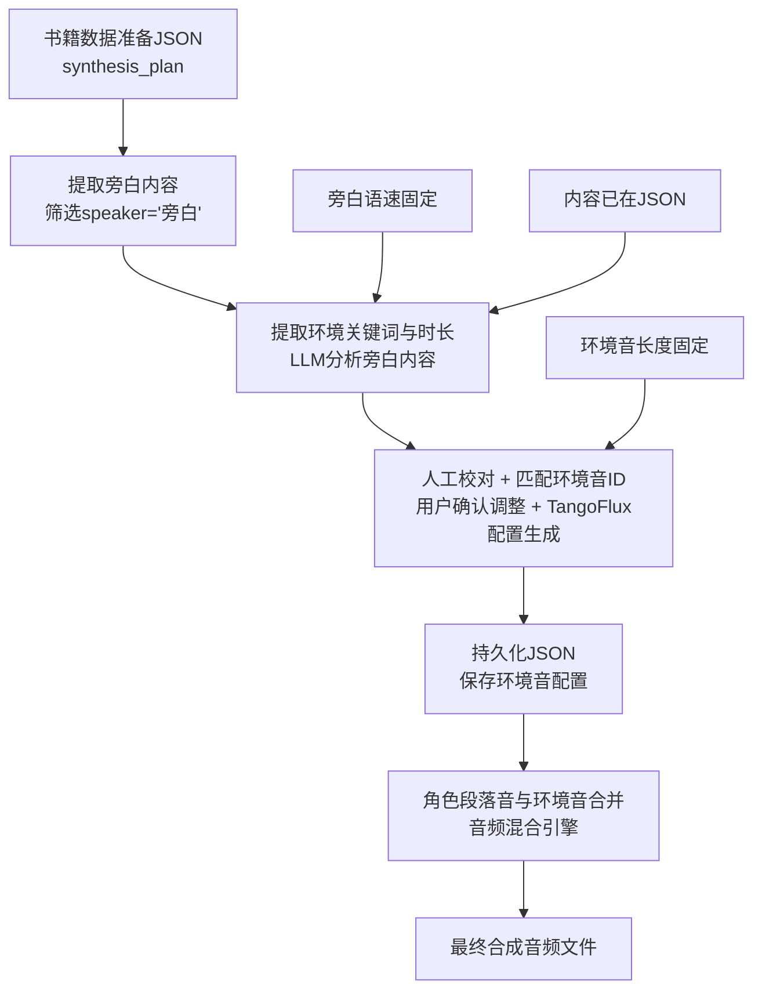

# 环境音混合完整架构设计

## 🎯 核心架构理念 (老爹的精准流程)

**核心流程**：环境音生成 → 分析JSON → 进旁白 → 提取环境关键词与时长(LLM) → 人工校对(含匹配环境音ID) → 持久化JSON → 将角色段落音与环境音合并 → 最终合成音频文件

**关键要点**：
1. **数据源**：书籍数据准备JSON (synthesis_plan)
2. **分析目标**：只提取旁白内容 (旁白才会说环境内容)
3. **时长固定**：旁白语速固定，内容已在JSON，环境音长度也固定
4. **最终目标**：角色段落音与环境音合并生成最终音频

## 📊 完整数据流程 (基于老爹的核心流程)



## 🏗️ 核心架构组件

### 1. 旁白环境分析器 (核心步骤2-3)

#### 1.1 旁白内容提取 + 环境关键词分析
```python
class NarrationEnvironmentAnalyzer:
    """旁白环境分析器 - 从synthesis_plan提取旁白内容并分析环境"""
    
    def __init__(self):
        from app.services.llm_scene_analyzer import LLMSceneAnalyzer
        self.scene_analyzer = LLMSceneAnalyzer()
        
    async def extract_and_analyze_narration(self, synthesis_plan: List[Dict]) -> Dict:
        """从synthesis_plan提取旁白内容并分析环境关键词与时长"""
        environment_tracks = []
        cumulative_time = 0.0
        
        for segment in synthesis_plan:
            # 只处理旁白segments (旁白才会说环境内容)
            if segment.get('speaker') == '旁白':
                
                # 计算旁白时长 (旁白语速固定，内容已在JSON)
                narration_text = segment.get('text', '')
                estimated_duration = self._calculate_narration_duration(narration_text)
                
                # LLM分析环境关键词
                environment_analysis = await self.scene_analyzer.analyze_scene(
                    text=narration_text,
                    context={'speaker': '旁白', 'duration': estimated_duration}
                )
                
                if environment_analysis.get('environment_detected'):
                    environment_tracks.append({
                        'segment_id': segment['segment_id'],
                        'start_time': cumulative_time,
                        'duration': estimated_duration,
                        'narration_text': narration_text,
                        'environment_keywords': environment_analysis.get('scene_keywords', []),
                        'scene_description': environment_analysis.get('scene_description', ''),
                        'confidence': environment_analysis.get('confidence', 0.0)
                    })
                
                cumulative_time += estimated_duration
            else:
                # 非旁白段落，累加时长但不分析环境
                segment_duration = self._calculate_segment_duration(segment)
                cumulative_time += segment_duration
                
        return {'environment_tracks': environment_tracks}
        
    def _calculate_narration_duration(self, text: str) -> float:
        """计算旁白时长 (语速固定)"""
        # 假设旁白语速：每分钟300字
        chars_per_minute = 300
        char_count = len(text.replace(' ', '').replace('\n', ''))
        return (char_count / chars_per_minute) * 60.0
        
    def _calculate_segment_duration(self, segment: Dict) -> float:
        """计算其他段落时长"""
        # 从segment中获取预估时长或根据文本计算
        return segment.get('estimated_duration', 0.0)
```

### 2. 人工校对 + 环境音ID匹配器 (核心步骤4)

#### 2.1 环境音配置校对器 (含ID匹配)
```python
class EnvironmentConfigValidator:
    """环境音配置校对器 - 支持人工确认调整 + 自动匹配环境音ID"""
    
    def __init__(self):
        self.narration_analyzer = NarrationEnvironmentAnalyzer()
        self.tangoflux_generator = TangoFluxGenerator()
        
    async def generate_initial_config(self, project_id: int, synthesis_plan: List[Dict]) -> Dict:
        """生成初始环境音配置供人工校对"""
        
        # 1. 分析旁白内容提取环境关键词与时长
        analysis_result = await self.narration_analyzer.extract_and_analyze_narration(
            synthesis_plan
        )
        
        # 2. 生成初始配置
        initial_config = {
            'project_id': project_id,
            'environment_tracks': analysis_result['environment_tracks'],
            'validation_status': 'pending_review',  # 等待人工校对
            'created_at': datetime.now().isoformat()
        }
        
        return initial_config
        
    async def validate_and_generate_final_config(self, 
                                               initial_config: Dict, 
                                               user_adjustments: Dict = None) -> Dict:
        """人工校对完成后生成最终配置（含环境音ID）"""
        
        final_environment_config = []
        
        for track in initial_config['environment_tracks']:
            # 应用用户调整
            if user_adjustments and track['segment_id'] in user_adjustments:
                adjustments = user_adjustments[track['segment_id']]
                final_keywords = adjustments.get('keywords', track['environment_keywords'])
                final_duration = adjustments.get('duration', track['duration'])
                final_volume = adjustments.get('volume', 0.3)
                user_confirmed = True
            else:
                # 使用原始分析结果
                final_keywords = track['environment_keywords']
                final_duration = track['duration']
                final_volume = 0.3
                user_confirmed = False
            
            # 生成环境音ID和TangoFlux配置 (校对步骤的子项)
            environment_id = f"env_{track['segment_id']}_{int(time.time())}"
            tango_config = await self._generate_tango_config(
                keywords=final_keywords,
                duration=final_duration
            )
            
            final_environment_config.append({
                'environment_id': environment_id,
                'segment_id': track['segment_id'],
                'start_time': track['start_time'],
                'duration': final_duration,
                'environment_keywords': final_keywords,
                'tango_prompt': tango_config['prompt'],
                'generation_params': tango_config['params'],
                'audio_settings': {
                    'volume': final_volume,
                    'fade_in': 3.0,
                    'fade_out': 2.0
                },
                'user_confirmed': user_confirmed,
                'source_narration': track['narration_text']
            })
            
        return {
            'project_id': initial_config['project_id'],
            'environment_audio_config': final_environment_config,
            'config_status': 'ready_for_persistence',  # 准备持久化
            'validated_at': datetime.now().isoformat()
        }
        
    async def _generate_tango_config(self, keywords: List[str], duration: float) -> Dict:
        """生成TangoFlux配置 (校对步骤的子项)"""
        if keywords:
            prompt = f"ambient sound of {', '.join(keywords)}, natural environment audio"
        else:
            prompt = "quiet ambient background sound"
            
        return {
            'prompt': prompt,
            'params': {
                'guidance_scale': 3.0,
                'num_inference_steps': 100,
                'audio_length_in_s': duration
            }
        }
```

### 3. 配置持久化系统 (核心步骤5)

#### 3.1 环境音配置持久化器
```python
class EnvironmentConfigPersistence:
    """环境音配置持久化器 - 人工校对完成后立即持久化"""
    
    def __init__(self):
        pass
        
    async def save_environment_config(self, final_config: Dict) -> Dict:
        """保存最终环境音配置到数据库"""
        
        project_id = final_config['project_id']
        
        # 保存到项目配置
        project = db.query(NovelProject).filter(NovelProject.id == project_id).first()
        if not project:
            raise ValueError(f"Project {project_id} not found")
            
        if project.config is None:
            project.config = {}
            
        # 持久化环境音配置
        project.config['environment_audio'] = {
            'environment_tracks': final_config['environment_audio_config'],
            'global_settings': {
                'enable_fade_transition': True,
                'default_volume': 0.3,
                'fade_overlap_duration': 1.0
            },
            'config_status': 'persisted',
            'created_at': final_config['validated_at'],
            'persisted_at': datetime.now().isoformat()
        }
        
        db.commit()
        
        return {
            'project_id': project_id,
            'persistence_status': 'success',
            'config_path': f'project_{project_id}.environment_audio',
            'persisted_at': datetime.now().isoformat(),
            'environment_count': len(final_config['environment_audio_config'])
        }
        
    async def load_environment_config(self, project_id: int) -> Optional[Dict]:
        """加载项目的环境音配置"""
        project = db.query(NovelProject).filter(NovelProject.id == project_id).first()
        if project and project.config and 'environment_audio' in project.config:
            return project.config['environment_audio']
        return None
        
    async def update_generation_status(self, project_id: int, environment_id: str, 
                                     status: str, file_path: str = None) -> bool:
        """更新环境音生成状态"""
        config = await self.load_environment_config(project_id)
        if not config:
            return False
            
        # 更新对应环境音的生成状态
        for track in config['environment_tracks']:
            if track['environment_id'] == environment_id:
                track['generation_status'] = status
                if file_path:
                    track['generated_file_path'] = file_path
                break
                
        # 保存更新
        project = db.query(NovelProject).filter(NovelProject.id == project_id).first()
        project.config['environment_audio'] = config
        db.commit()
        
        return True
```

### 3. 环境音JSON生成器

#### 3.1 智能JSON配置生成
```python
class EnvironmentJSONGenerator:
    """环境音JSON配置生成器 - 不复用现有环境音库"""
    
    def __init__(self):
        self.tangoflux_generator = TangoFluxGenerator()
        
    async def generate_environment_config(self, environment_timeline: List[Dict]) -> Dict:
        """生成环境音JSON配置"""
        environment_tracks = []
        
        for env_item in environment_timeline:
            environment = env_item['environment']
            
            # 生成TangoFlux提示词和参数
            tango_config = await self._generate_tango_config(environment)
            
            environment_tracks.append({
                'segment_id': env_item['segment_id'],
                'start_time': env_item['start_time'],
                'duration': env_item.get('duration', 10.0),
                'scene_description': environment.get('scene_description', ''),
                'tango_prompt': tango_config['prompt'],
                'generation_params': {
                    'guidance_scale': tango_config.get('guidance_scale', 3.0),
                    'num_inference_steps': tango_config.get('steps', 100),
                    'audio_length_in_s': env_item.get('duration', 10.0)
                },
                'fade_in': 3.0,
                'fade_out': 2.0,
                'volume': 0.3,
                'inherited': environment.get('inherited', False)
            })
                
        return {
            'project_environment_config': {
                'environment_tracks': environment_tracks,
                'global_settings': {
                    'enable_fade_transition': True,
                    'default_volume': 0.3,
                    'fade_overlap_duration': 1.0
                }
            }
        }
        
    async def _generate_tango_config(self, environment: Dict) -> Dict:
        """为环境生成TangoFlux配置"""
        scene_keywords = environment.get('scene_keywords', [])
        
        # 构建TangoFlux提示词
        if scene_keywords:
            prompt = f"ambient sound of {', '.join(scene_keywords)}, natural environment audio"
        else:
            prompt = "quiet ambient background sound"
            
        return {
            'prompt': prompt,
            'guidance_scale': 3.0,
            'steps': 100
        }
```

### 4. 配置持久化系统

#### 4.1 环境音配置存储
```python
class EnvironmentConfigPersistence:
    """环境音配置持久化"""
    
    async def save_environment_config(self, project_id: int, environment_config: Dict):
        """保存环境音配置到数据库"""
        config_data = {
            'project_id': project_id,
            'environment_timeline': environment_config['environments'],
            'generation_params': {
                'fade_in_duration': 3.0,
                'fade_out_duration': 2.0,
                'overlap_duration': 1.0,
                'base_volume': 0.3
            },
            'created_at': datetime.now().isoformat()
        }
        
        # 保存到项目配置
        project = db.query(NovelProject).filter(NovelProject.id == project_id).first()
        if project.config is None:
            project.config = {}
        project.config['environment_audio'] = config_data
        db.commit()
        
    async def load_environment_config(self, project_id: int) -> Optional[Dict]:
        """加载项目的环境音配置"""
        project = db.query(NovelProject).filter(NovelProject.id == project_id).first()
        if project and project.config and 'environment_audio' in project.config:
            return project.config['environment_audio']
        return None
```

## 🔄 核心业务逻辑

### 场景继承逻辑
- **规则**：新旁白无环境描述时，继承上一个环境设置
- **实现**：在LLM分析结果为空时，复制上一段落的环境配置
- **标记**：继承的环境音段落标记 `inherited: true`

### 环境音优先级
- **规则**：文本中多个环境元素时，最新出现的优先级最高
- **实现**：按文本出现顺序解析，后出现的元素覆盖前面的
- **分层**：主环境音 + 背景环境音的层次结构

### 渐变过渡处理
- **新环境音**：3秒渐入 (fade_in: 3.0s)
- **旧环境音**：2秒渐出 (fade_out: 2.0s)
- **重叠过渡**：1秒重叠期，平滑切换
- **音量控制**：基础音量30%，可配置

## 🚀 集成点设计

### 1. API集成
```python
# 在现有合成接口中添加环境音支持
@router.post("/projects/{project_id}/start-generation")
async def start_audio_generation(
    project_id: int,
    enable_environment: bool = Form(False, description="启用环境音混合"),
    environment_volume: float = Form(0.3, description="环境音音量")
):
    if enable_environment:
        # 集成环境音混合流程
        environment_config = await synthesis_center_integration.enable_environment_synthesis(
            project_id, synthesis_data
        )
        
        # 使用环境音混合协调器
        result = await environment_synthesis_coordinator.synthesize_with_environment(
            project_id, synthesis_data, environment_config
        )
```

### 2. 前端集成
```javascript
// 在合成中心添加环境音配置
const handleEnvironmentSynthesis = async (config) => {
  const response = await api.startEnvironmentSynthesis(
    project.value.id,
    selectedChapter.value,
    {
      enable_environment: true,
      environment_volume: config.environmentVolume,
      auto_scene_detection: true,
      fade_transition: true
    }
  )
}
```

## 📋 实施优先级

### 第一阶段：基础架构 (高优先级)
1. **服务复用适配器** - 让合成中心调用环境音LLM分析器
2. **旁白提取器** - 从synthesis_plan中筛选环境描述段落
3. **基础匹配引擎** - 现有音效 vs TangoFlux生成的决策逻辑

### 第二阶段：核心功能 (中优先级)
4. **场景继承逻辑** - 无环境描述时的继承机制
5. **优先级处理** - 多环境元素的优先级排序
6. **配置持久化** - 环境音配置的存储和复用

### 第三阶段：体验优化 (低优先级)
7. **渐变过渡处理** - 平滑的音频切换效果
8. **人工校对界面** - 用户可调整环境音配置
9. **性能优化** - 缓存和批量处理

## 🎯 预期效果

1. **架构复用**：最大化利用现有环境音管理的LLM分析能力
2. **数据流高效**：直接从书籍合成JSON提取，无需重新解析
3. **匹配智能**：优先使用高质量预制音效，缺失时实时生成
4. **用户可控**：支持人工校对和配置调整
5. **体验流畅**：平滑的渐变过渡和场景继承逻辑

---

**基于完整架构的环境音混合设计，聚焦服务复用和数据流优化！** 🎵 