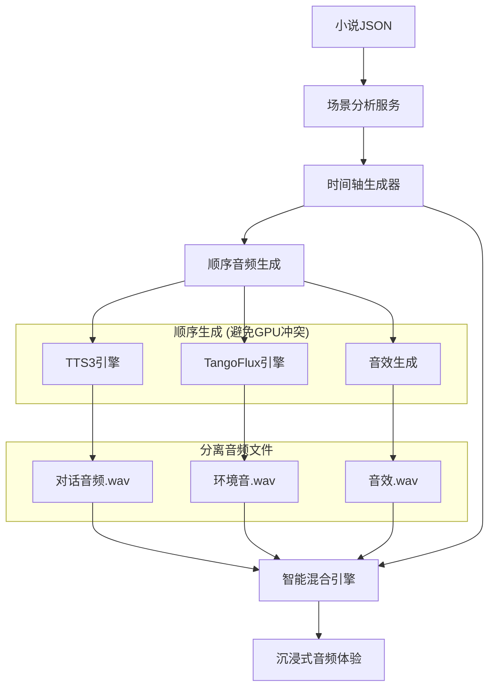

# 🎵 环境音混合系统设计方案

## 📖 项目概述

AI-Sound 环境音混合系统，旨在将 **TTS3对话音频** 与 **TangoFlux环境音** 智能混合，实现从传统"听书"到沉浸式"听电影"的音频体验革命。

## 🎯 核心价值

### 当前痛点
- ✅ TTS3: 高质量对话语音合成
- ✅ TangoFlux: 专业环境音效生成  
- ❌ **缺失**: 两者智能混合，缺乏沉浸感

### 解决方案
- 🧠 **AI场景分析**: 智能识别文本中的环境信息
- ⏰ **时间轴同步**: 确保环境音在正确时间点出现
- 🎛️ **智能混音**: 专业级多轨音频混合技术

### 最终效果
```
传统模式: 用户听到纯粹的朗读声音
沉浸模式: 角色在真实环境中对话 + 背景环境音效
```

## 🏗️ 系统架构



## 📚 文档结构

| 文档 | 内容 | 状态 |
|------|------|------|
| [00_总体方案设计.md](./00_总体方案设计.md) | 系统整体架构和技术方案 | ✅ |
| [01_场景分析服务设计.md](./01_场景分析服务设计.md) | AI驱动的场景识别与分析 | ✅ |
| [02_时间轴生成器设计.md](./02_时间轴生成器设计.md) | 音频时间轴同步技术 | ✅ |
| [03_音频混合引擎设计.md](./03_音频混合引擎设计.md) | 专业级音频混合算法 | ✅ |
| [04_实现计划.md](./04_实现计划.md) | 分阶段开发路线图 | ✅ |
| [05_大模型服务集成设计.md](./05_大模型服务集成设计.md) | GPT-4/Claude等大模型深度集成 | ✅ |
| [06_优化后的音频生成流程.md](./06_优化后的音频生成流程.md) | 顺序生成避免GPU显存爆炸 | ✅ |

## 🚀 快速开始

### 核心技术栈
- **后端**: Python + FastAPI + pydub + ffmpeg
- **AI服务**: GPT-4o/Claude-3 (主力) + Ollama (兜底) + 智能缓存
- **音频处理**: pydub + numpy + scipy + 专业音频算法
- **前端**: Vue3 + Ant Design Vue (现有架构)

### 开发分支
```bash
# 当前所在分支
git branch
# * feature/environment-audio-mixing

# 查看方案文件
ls 环境音混合/
```

## 🎛️ 核心功能特性

### 1. 智能场景分析 🧠
- **多维度识别**: 地点、天气、时间、氛围、情绪
- **AI + 规则**: Ollama语义理解 + 关键词匹配
- **置信度评分**: 确保分析结果可靠性

### 2. 精确时间轴同步 ⏰
- **两阶段生成**: 预估时间轴 → 精确调整
- **漂移修正**: 自动处理TTS实际时长与预估的差异
- **场景持续性**: 智能判断环境音的开始和结束时机

### 3. 专业音频混合 🎵
- **多轨协调**: 对话、环境音、音效、氛围四轨混合
- **智能闪避**: 对话时环境音自动降低
- **质量优化**: 动态范围控制、自适应均衡、空间增强

## 📊 技术指标

| 指标类型 | 目标值 | 测量方式 |
|----------|--------|----------|
| 场景识别准确率 | ≥85% | AI模型评估 |
| 时间轴同步精度 | ±0.5秒 | 音频分析 |
| 音频处理速度 | <10秒/分钟 | 性能测试 |
| 混合音频质量 | THD+N <0.1% | 专业音频分析 |
| 用户满意度 | ≥4.0/5.0 | 用户调研 |

## 🛣️ 开发路线

### 阶段1: MVP (2-3周)
- ✅ 场景分析基础框架
- ✅ 简单时间轴生成  
- ✅ 基础音频混合
- ✅ 前端基础界面

### 阶段2: 智能优化 (3-4周)  
- 🔄 AI驱动场景检测
- 🔄 智能闪避算法
- 🔄 音质优化技术

### 阶段3: 用户体验 (2-3周)
- 🔄 高级混音控制面板
- 🔄 用户自定义功能
- 🔄 性能优化与测试

## 🧪 测试策略

### 技术测试
- **单元测试**: 核心算法准确性
- **集成测试**: 端到端流程验证
- **性能测试**: 并发和响应时间
- **音质测试**: 专业音频质量分析

### 用户测试
- **功能测试**: 典型使用场景
- **易用性测试**: 界面操作流程
- **满意度调研**: 音频体验评价

## 💡 创新亮点

### 1. 业界首创
- **小说音频的环境音智能混合**: 目前市场上尚无同类产品
- **AI驱动的场景音效映射**: 创新的文本-音效智能匹配

### 2. 技术先进性
- **大模型深度集成**: GPT-4o级别的超强场景理解和创意音效设计
- **混合AI策略**: 云端大模型 + 本地模型 + 智能降级，兼顾质量和成本
- **自适应音频处理**: 基于内容自动调节混音参数
- **实时质量优化**: 音频质量实时监控和自动增强

### 3. 用户体验革命
- **从听书到听电影**: 音频体验质的飞跃
- **个性化定制**: 用户可自定义混音偏好
- **专业级质量**: 达到广播级音频标准

## 📈 商业价值

### 竞争优势
- **技术壁垒**: 复杂的AI+音频处理技术组合
- **用户黏性**: 沉浸式体验提升用户满意度
- **市场差异化**: 在AI语音合成领域建立独特优势

### 应用扩展
- **有声书制作**: 专业出版社合作
- **教育内容**: 语言学习、历史讲述等
- **娱乐内容**: 播客、故事播放等
- **无障碍服务**: 视觉障碍用户的沉浸式阅读

## 🤝 参与贡献

### 开发团队
- **AI算法工程师**: 场景分析模型优化
- **音频处理工程师**: 混音算法开发
- **全栈工程师**: 系统集成和接口开发
- **产品设计师**: 用户体验优化

### 协作方式
- **代码Review**: 确保代码质量
- **技术讨论**: 定期技术方案评审
- **用户测试**: 收集反馈，迭代改进

---

## 📞 联系方式

- **项目负责人**: [项目经理联系方式]
- **技术咨询**: [技术团队联系方式]  
- **产品反馈**: [产品团队联系方式]

---

**🎉 让我们一起打造下一代沉浸式音频体验！**