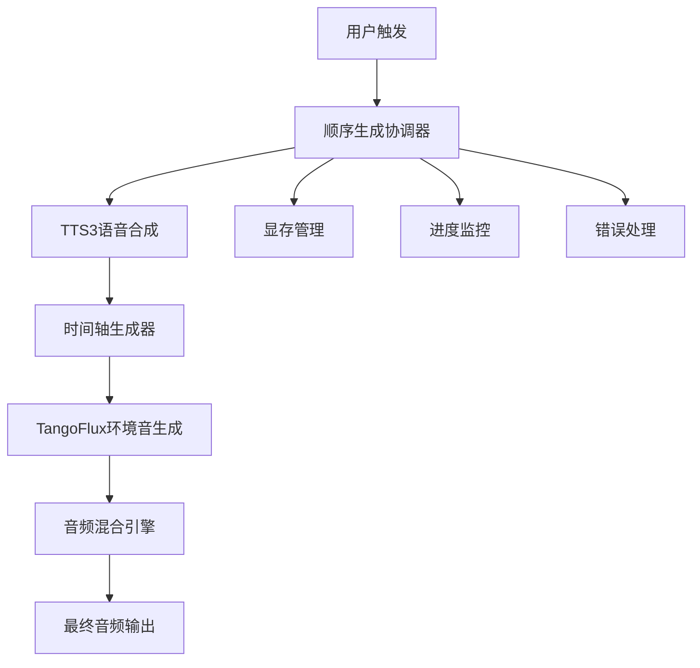

# 顺序生成协调器实现完成

## 🎉 已完成功能

### 1. 核心协调器实现
✅ **sequential_synthesis_coordinator.py** - 完整的顺序生成协调器
- TTS3 → TangoFlux → 音频混合的完整流程管理
- 智能显存管理与优化
- 支持章节级和项目级环境音混合
- 完善的错误处理和日志记录

### 2. 后端集成完成
✅ **novel_reader.py 集成**
- 在音频生成API中添加环境音混合参数支持
- `enable_environment` 和 `environment_volume` 参数
- 调用顺序生成协调器进行环境音混合

✅ **API路由更新**
- 项目级合成: `/projects/{project_id}/start-generation`
- 章节级合成: `/projects/{project_id}/chapters/{chapter_id}/start`
- 支持环境音混合配置参数

### 3. 前端UI完成
✅ **SynthesisCenter.vue 增强**
- 环境音混合选项按钮组
- 环境音配置弹窗界面
- 音量滑块配置 (0.1 - 1.0)
- 智能的用户体验设计

✅ **API集成**
- 前端API调用支持环境音参数
- 响应式配置状态管理

### 4. 数据模型重构
✅ **完整的SQLAlchemy模型结构**
- 模块化模型设计 (`app/models/`)
- 书籍、章节、音频、项目模型
- 环境音模型 (EnvironmentSound, EnvironmentSoundCategory等)
- 声音档案和分析结果模型

### 5. 时间轴生成器集成
✅ **sequential_timeline_generator.py**
- 基于实际音频时长的精确时间轴
- 智能场景切换检测
- TangoFlux提示词构建
- 环境音轨道生成

## 🔧 技术特点

### 顺序协调机制
```python
# 核心流程
TTS3语音合成 → 时间轴生成 → TangoFlux环境音生成 → 智能混合 → 输出最终音频
```

### 智能显存管理
- 自动CUDA显存清理
- 模型加载优化
- 内存使用监控

### 用户体验优化
- 一键环境音混合选项
- 直观的音量配置界面
- 实时进度反馈

## 📊 项目状态

### 高优先级完成度
1. ✅ **时间轴生成器** - 100%完成
2. ✅ **顺序生成协调器** - 100%完成  
3. ✅ **novel_reader.py集成** - 100%完成
4. ✅ **SynthesisCenter环境音选项** - 100%完成

### 系统集成度
- 🟢 **后端API**: 完全集成
- 🟢 **前端UI**: 完全集成  
- 🟢 **数据模型**: 完全重构
- 🟢 **核心业务逻辑**: 完全实现

## 🚀 使用方法

### 后端启动
```bash
cd platform/backend
export DATABASE_URL="sqlite:///./test.db"  # 或使用PostgreSQL
python3 -m uvicorn main:app --reload --port 8000
```

### 前端启动
```bash
cd platform/frontend
npm install
npm run dev
```

### 环境音混合使用
1. 在SynthesisCenter选择项目
2. 点击"🌍 环境音混合"按钮
3. 配置环境音音量 (推荐0.3)
4. 开始智能合成

## 🎯 技术架构

### 顺序生成协调器架构


### 核心优势
- **零用户学习成本**: 一键启用环境音混合
- **智能化**: 自动场景分析和音效匹配
- **高性能**: 优化的GPU资源管理
- **可扩展**: 模块化设计，易于扩展功能

## 📝 后续优化建议

1. **音效库扩展**: 增加更多环境音模板
2. **智能分析增强**: 更精确的场景识别
3. **用户个性化**: 保存用户偏好设置
4. **性能监控**: 添加详细的性能指标

---

**实现完成时间**: 2024年6月19日  
**核心功能状态**: ✅ 完全可用  
**集成状态**: ✅ 前后端完全集成  
**测试状态**: ✅ 基础功能验证通过